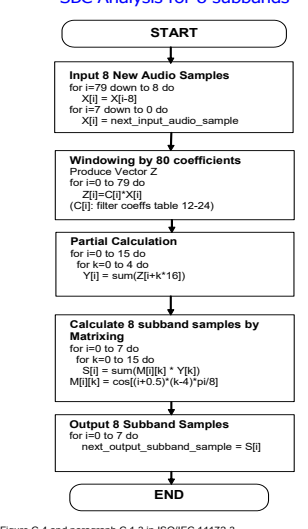

# Advanced Audio Distribution Profile

Bluetooth® Profile Specification
=
Revision: v1.4
=
Revision Date: 2022-06-21
=
Prepared By: Audio, Telephony, and Automotive Working Group

## Abstract:

This profile defines the requirements for Bluetooth devices necessary for support of the high-quality audio distribution. The requirements are expressed in terms of end-user services, and by defining the features and procedures that are required for interoperability between Bluetooth devices in the Audio Distribution usage model.

# Advanced Audio Distribution Profile / Profile Specification

## Revision History

| Revision   | Date         | Comments                                         |
|------------|--------------|--------------------------------------------------|
| v1.3.1     | 14 July 2015 | Adopted by the Bluetooth SIG BoD                 |
| v1.3.2     | 2019-01-21   | Adopted by the Bluetooth SIG Board of Directors  |
| v1.4       | 2022-06-21   | Adopted by the Bluetooth SIG Board of Directors. |

| Acknowledgments   |                    |
|-------------------|--------------------|
| Name              | Company            |
|                   | Berner and Mattner |
| Rüdiger Mosig     | Broadcom           |
| Alicia Courtney   | Broadcom           |
| Ash Kapur         | CSR                |
| Jiny Bradshaw     | CSR                |
| Allan Madsen      | CSR                |
| David Trainor     | Denso              |
| Akira Miyajima    | Dolby              |
| Christof Fersch   | Dolby              |
| Daniel Fischer    | Ericsson           |
| Morgan Lindqvist  | Ericsson           |
| Fisseha Mekuria   | Ericsson           |
| Wim Koster        |                    |

| Versions         | Changes                                                             |
|------------------|---------------------------------------------------------------------|
| v1.3.0 to v1.3.1 | Incorporated erratum E5272.                                         |
| v1.3.1 to v1.3.2 | Incorporated errata E6731, E7369, E7370, E9120, E9121, and E9494.   |
| v1.3.2 to v1.4.0 | Incorporated errata E18038, E18039, E18116, E18163, E18164, E18165, |
|                  | E18209, E18211, , E18314, E18340, E18360, E18368, E18369, E18370,   |
|                  | E18398, E18481, E18482, 18398, 18705, 18812, E18994.                |

## Version History

Advanced Audio Distribution Profile  /  Profile Specification

| Name                | Company                        |
|---------------------|--------------------------------|
|                     | Ericsson                       |
| Rene Kuiken         | Fraunhofer IIS                 |
| Daniel Richter      | Fraunhofer IIS                 |
| Max Neuendorf       | Fraunhofer IIS                 |
| Markus Schnell      | Marvell                        |
| Yuan Quinton        | Matsushita Electric Industrial |
| Tsuyoshi Okada      | Mecel                          |
| Thomas Karlsson     | Nokia                          |
| Kalervo Kontola     | Nokia                          |
| Vesa Lunden         | Nokia                          |
| Janne Hamalainen    | Nokia                          |
| Jurgen Schnitzler   | Parrot                         |
| Thierry Wœlfflé     | Philips                        |
| Shaun Barrett       | Philips                        |
| Christian Bouffioux | Philips                        |
| Frans de Bont       | Philips                        |
| Rob J. Davies       | Philips                        |
| Emmanuel Mellery    | Philips                        |
| Marc Vauclair       | Plantronics                    |
| Scott Walsh         | Qualcomm                       |
| Brian Gix           | Qualcomm                       |
| John Larkin         | Sony                           |
| Atsushi Ichise      |                                |

Advanced Audio Distribution Profile  /  Profile Specification

| Name                | Company   |
|---------------------|-----------|
|                     | Sony      |
| Harumi Kawamura     | Sony      |
| Hiroyasu Noguchi    | Sony      |
| Kenzo Akagiri       | Sony      |
| Masahiko Seki       | Sony      |
| Masayuki Nishiguchi | Sony      |
| Masakazu Hattori    | Sony      |
| Rüdiger Mosig       | Sony      |
| Tomoko Tanaka       | Sony      |
| Wilhelm Hagg        |           |
| Yoshiyuki Nezu      | Sony      |
|                     | Symbian   |
| Siân James          | Toshiba   |
| Junko Ami           | Toshiba   |
| Takeshi Saito       | Toshiba   |
| Yoshiaki Takabatake | Toshiba   |
| Yoichi Takebayashi  | Toshiba   |
| Ichiro Tomoda       | Toshiba   |
| Junichi Yoshizawa   |           |

Use of this specification is your acknowledgement that you agree to and will comply with the following notices and disclaimers. You are advised to seek appropriate legal, engineering, and other professional advice regarding the use, interpretation, and effect of this specification.

Use of Bluetooth specifications by members of Bluetooth SIG is governed by the membership and other related agreements between Bluetooth SIG and its members, including those agreements posted on Bluetooth SIG's website located at www.bluetooth.com. Any use of this specification by a member that is not in compliance with the applicable membership and other related agreements is prohibited and, among other things, may result in (i) termination of the applicable agreements and (li) llability for infringement of the intellectual property rights of Bluetooth SIG and its members. This specification may provide options, because, for example, some products do not implement every portion of the specification.

All content within the specification, including notes, appendices, figures, tables, message sequence charts, examples, sample data, and each option identified is intended to be within the bounds of the Scope as defined in the Bluetooth Patent/Copyright License Agreement ("PCLA"). Also, the identification of options for implementing a portion of the specification is intended to provide design flexibility without establishing, for purposes of the PCLA, that any of these options is a "technically reasonable non-infringing alternative."
Use of this specification by anyone who is not a member of Bluetooth SIG is prohibited and is an infringement of the intellectual property rights of Bluetooth SIG and its members. The furnishing of this specification does not grant any license to any intellectual property of Bluetooth SIG or its members. THIS SPECIFICATION IS PROVIDED "AS IS" AND BLUETOOTH
SIG, ITS MEMBERS AND THEIR AFFILIATES MAKE NO REPRESENTATIONS OR WARRANTIES AND DISCLAIM ALL
WARRANTIES, EXPRESS OR IMPLIED, INCLUDING ANY WARRANTIES OF MERCHANTABILITY, TITLE, NON-
INFRINGEMENT, FITNESS FOR ANY PARTICULAR PURPOSE, OR THAT THE CONTENT OF THIS SPECIFICATION IS FREE
OF ERRORS. For the avoidance of doubt, Bluetooth SIG has not made any search or investigation as to third partles that may claim rights in or to any specifications or any intellectual property that may be required to implement any specifications and it disclaims any obligation or duty to do so.

TO THE MAXIMUM EXTENT PERMITTED BY APPLICABLE LAW, BLUETOOTH SIG, ITS MEMBERS AND THEIR AFFILIATES
DISCLAIM ALL LIABILITY ARISING OUT OF OR RELATING TO USE OF THIS SPECIFICATION AND ANY INFORMATION
CONTAINED IN THIS SPECIFICATION, INCLUDING LOST REVENUE, PROFITS, DATA OR PROGRAMS, OR BUSINESS
INTERRUPTION, OR FOR SPECIAL, INDIRECT, CONSEQUENTIAL, INCIDENTAL OR PUNITIVE DAMAGES, HOWEVER CAUSED AND REGARDLESS OF THE THEORY OF LIABILITY, AND EVEN IF BLUETOOTH SIG, ITS MEMBERS OR THEIR
AFFILIATES HAVE BEEN ADVISED OF THE POSSIBILITY OF THE DAMAGES.

Products equipped with Bluetooth wireless technology ("Bluetooth Products") and their combination, operation, use, implementation, and distribution may be subject to regulatory controls under the laws and regulations of numerous countries that regulate products that use wireless non-licensed spectrum. Examples include airline regulations, telecommunications regulations, technology transfer controls, and health and safety regulations. You are solely responsible for complying with all applicable laws and regulations and for obtaining any and all required authorizations, permits, or licenses in connection with your use of this specification and development, manufacture, and distribution of Bluetooth Products. Nothing in this specification provides any information or assistance in connection with complying with applicable laws or regulations or obtaining required authorizations, permits, or licenses. Bluetooth SIG is not required to adopt any specification or portion thereof. If this specification is not the final version adopted by Bluetooth SIG's Board of Directors, it may not be adopted. Any specification adopted by Bluetooth SIG's Board of Directors may be withdrawn, replaced, or modified at any time. Bluetooth SIG reserves the right to change or alter final specifications in accordance with its membership and operating agreements. Copyright © 2001–2022. All copyrights in the Bluetooth Specifications themselves are owned by Apple Inc., Ericsson AB, Intel Corporation, Lenovo (Singapore) Pte. Ltd., Microsoft Corporation, Nokia Corporation, and Toshiba Corporation. The Bluetooth word mark and logos are owned by Bluetooth SIG, Inc. Other third-party brands and names are the property of their respective owners.

| Contents   |                                                            |
|------------|------------------------------------------------------------|
| 1          | Introduction                                               |
| 1.1        | Scope                                                      |
|            | Profile dependency .                                       |
| 1.2        |                                                            |
| 1.3        | Symbols and conventions                                    |
| 1.3.1      | Requirement status symbols .                               |
| 1.4        | Bluetooth A2DP Profile change history                      |
| 1.4.1      | Changes from 1.3 to 1.4                                    |
| 1.4.1.1    | New features .                                             |
| 1.5        | Language .                                                 |
| 1.5.1      | Language conventions .                                     |
| 1.5.2      | Reserved for Future Use                                    |
| 1.5.3      | Prohibited .                                               |
| 2          | Profile overview                                           |
| 2.1        | Profile stacks .                                           |
| 2.2        | Configurations and roles .                                 |
| 2.3        | User requirements and scenarios.                           |
| 2.4        | Profile fundamentals .                                     |
| 2.5        | Conformance                                                |
| 3          | Application layer                                          |
| 3.1        | Audio Streaming setup                                      |
| 3.2        | Audio Streaming                                            |
| 3.2.1      | Send Audio Stream                                          |
| 3.2.2      | Receive Audio Stream .                                     |
| 4          | Audio codec interoperability requirements                  |
| 4.1        | Overview .                                                 |
| 4.2        | Support of codec interoperability requirements .           |
| 4.2.1      | Mandatory codec interoperability requirements              |
| 4.2.2      | Optional codec interoperability requirements .             |
| 4.2.3      | Vendor Specific A2DP codec interoperability requirements . |
| 4.2.4      | Unsupported codec interoperability requirements            |
| 4.2.5      | Audio Codec Type values                                    |
| 4.3        | SBC codec interoperability requirements                    |
|            | Reference                                                  |
| 4.3.1      |                                                            |
| 4.3.2      | Codec Specific Information Elements                        |
| 4.3.2.1    | Sampling Frequency .                                       |
|            | Channel Mode .                                             |
| 4.3.2.2    |                                                            |
| 4.3.2.3    | Block Length .                                             |
| 4.3.2.4    | Subbands .                                                 |
| 4.3.2.5    | Allocation Method                                          |
| 4.3.2.6    | Minimum / Maximum Bitpool Value                            |
|            | Media packet header requirements                           |
| 4.3.3      |                                                            |
| 4.3.3.1    | Timestamp (TS) .                                           |
| 4.3.3.2    | Payload type (PT).                                         |

|         | Marker (M) bit .                                         |
|---------|----------------------------------------------------------|
| 4.3.3.3 |                                                          |
| 4.3.3.4 | Extension (X) bit                                        |
| 4.3.4   | Media payload format .                                   |
| 4.4     | MPEG-1,2 Audio codec interoperability requirements.      |
| 4.4.1   | Reference                                                |
| 4.4.2   | Codec Specific Information Elements                      |
| 4.4.2.1 | Layer                                                    |
| 4.4.2.2 | CRC Protection                                           |
| 4.4.2.3 | Channel Mode .                                           |
| 4.4.2.4 | Media payload format (MPF) .                             |
| 4.4.2.5 | Sampling Frequency .                                     |
| 4.4.2.6 | VBR                                                      |
| 4.4.2.7 | Bit Rate Index .                                         |
| 4.4.3   | Media packet header requirements .                       |
| 4.4.4   | Media payload format .                                   |
| 4.5     | MPEG-2, 4 AAC codec interoperability requirements        |
| 4.5.1   | Reference                                                |
|         | Codec Specific Information Elements                      |
| 4.5.2   |                                                          |
| 4.5.2.1 | Object Type                                              |
| 4.5.2.2 | MPEG-D DRC .                                             |
| 4.5.2.3 | Sampling Frequency .                                     |
| 4.5.2.4 | Channels .                                               |
| 4.5.2.5 | Bit rate .                                               |
| 4.5.2.6 | VBR                                                      |
| 4.5.3   | Media packet header requirements                         |
| 4.5.4   | Media payload format .                                   |
| 4.6     | ATRAC family codec interoperability requirements .       |
| 4.6.1   | Reference                                                |
| 4.6.2   | Codec Specific Information Elements                      |
| 4.6.2.1 | Version                                                  |
| 4.6.2.2 | Channel Mode .                                           |
| 4.6.2.3 | Fs (Sampling Frequency)                                  |
| 4.6.2.4 | VBR                                                      |
| 4.6.2.5 | Bit Rate Index .                                         |
|         | Maximum SUL                                              |
| 4.6.2.6 |                                                          |
| 4.6.3   | Media packet header requirements .                       |
| 4.6.3.1 | Timestamp (TS)                                           |
| 4.6.3.2 | Payload type (PT)                                        |
| 4.6.3.3 | Marker (M) bit .                                         |
| 4.6.3.4 | Extension (X) bit                                        |
| 4.6.4   | Media payload format .                                   |
| 4.7     | Vendor Specific A2DP codec interoperability requirements |
| 4.7.1   | Reference                                                |
| 4.7.2   | Codec Specific Information Elements                      |
| 4.7.2.1 | Vendor ID                                                |
| 4.7.2.2 | Vendor Specific Codec ID .                               |
| 4.7.2.3 | Vendor Specific Value                                    |
| 4.7.3   | Media packet header requirements                         |
|         | Media payload format .                                   |
| 4.7.4   |                                                          |

| 4.8                                                  | MPEG-D USAC codec interoperability requirements        |
|------------------------------------------------------|--------------------------------------------------------|
| 4.8.1                                                | Reference                                              |
| 4.8.2                                                | Codec Specific Information Elements                    |
| 4.8.2.1                                              | Object Type                                            |
| 4.8.2.2                                              | Sampling Frequency .                                   |
| 4.8.2.3                                              | Channels .                                             |
|                                                      | VBR                                                    |
| 4.8.2.4                                              |                                                        |
| 4.8.2.5                                              | Bit rate .                                             |
| 4.8.3                                                | Media packet header requirements                       |
| 4.8.4                                                | Media payload format .                                 |
| 5                                                    | GAVDP interoperability requirements                    |
| 5.1                                                  | AVDTP interoperability requirements                    |
| 5.1.1                                                | Signaling procedures .                                 |
| 5.1.1.1                                              | Streaming roles                                        |
|                                                      | Delay Reporting roles                                  |
| 5.1.1.2                                              |                                                        |
| 5.1.2                                                | Transport services .                                   |
| 5.1.3                                                | Error codes                                            |
| 5.2                                                  | L2CAP interoperability requirements                    |
| 5.2.1                                                | Maximum Transmission Unit.                             |
| 5.3                                                  | SDP interoperability requirements                      |
| 5.4                                                  | Link Manager interoperability requirements .           |
| 5.5                                                  | Link Controller interoperability requirements          |
| 5.5.1                                                | Class of Device                                        |
| 6                                                    | Generic Access Profile interoperability requirements . |
| 6.1                                                  | Modes                                                  |
| 6.2                                                  | Security aspects .                                     |
| 6.3                                                  | Idle mode procedures .                                 |
| 7                                                    | Acronyms and abbreviations .                           |
| 8                                                    | References .                                           |
| Appendix A  Audio Streaming with content protection. |                                                        |
| Appendix B Technical Specification of SBC            |                                                        |
| B.1                                                  | Introduction .                                         |
| B.2                                                  | Glossary .                                             |
| B.3                                                  | Symbols and abbreviations.                             |
| B.3.1                                                | Arithmetic operators .                                 |
|                                                      | Logical operators                                      |
| B.3.2                                                |                                                        |
| B.3.3                                                | Relation operators                                     |
| B.3.4                                                | Bitwise operators                                      |
| B.3.5                                                | Assignment .                                           |
| B.3.6                                                | Mnemonics                                              |
| B.3.7                                                | Constants.                                             |
| B.3.8                                                | Ranges .                                               |
| B.3.9                                                | Number notation                                        |
| B.4                                                  | Syntax .                                               |
| B.5                                                  | Semantics                                              |
| B.5.1                                                | Frame_header .                                         |

|                              | scale_factors.                             |
|------------------------------|--------------------------------------------|
| B.5.2                        |                                            |
| B.5.3                        | audio_samples                              |
| B.5.4                        | padding                                    |
| B.6                          | Decoding processes .                       |
| B.6.1                        | Frame header .                             |
| B.6.1.1                      | CRC check                                  |
| B.6.2                        | Scale factors                              |
| B.6.3                        | Bit allocation .                           |
|                              | MONO and DUAL CHANNEL bit allocation .     |
| B.6.3.1                      |                                            |
| B.6.3.2                      | STEREO and JOINT_STEREO bit allocation .   |
| B.6.4                        | Reconstruction of the subband samples      |
| B.6.5                        | Joint processing .                         |
| B.6.6                        | Synthesis filter .                         |
| B.7                          | Encoding processes .                       |
| B.7.1                        | Analysis filter                            |
| B.7.2                        | Scale factors                              |
| B.7.3                        | JOINT_STEREO channel mode operation        |
| B.7.4                        | Bit allocation .                           |
| B.7.5                        | Quantization                               |
| B.8                          | Tables .                                   |
| B.9                          | Calculation of bit rate and frame length . |
| Appendix C Signaling flows . |                                            |
| C.1                          | Audio Streaming setup                      |
| C.2                          | Audio Streaming                            |

## 1 Introduction 1.1 Scope

The Advanced Audio Distribution Profile (A2DP) defines the protocols and procedures that realize distribution of audio content of high quality in mono, stereo, or multi-channel modes. The term "advanced audio", therefore, should be distinguished from "Bluetooth audio", which indicates distribution of narrow band voice on SCO channels as defined in Volume 2, Part B, Section 9 in the Bluetooth Core Specification [1].

A typical usage case is the streaming of music content from a stereo music player to headphones or speakers. The audio data is compressed in a proper format for efficient use of the limited bandwidth. A2DP focuses on audio streaming, while the Video Distribution Profile (VDP) specifies video streaming. Support of both profiles enables the distribution of video content accompanied with high-quality audio.

The usage case of video and audio streaming is described in VDP.

Note also that the A2DP does not include remote control functions. Devices may support remote control features by implementing both A2DP and the control profile as depicted, for example, in the usage scenario of Audio/Video Remote Control Profile (AVRCP) [2].

## 1.2 Profile Dependency

In Figure 1.1, the structure and the dependencies of the profiles are depicted. A profile is dependent upon another profile if it re-uses parts of that profile, by implicitly or explicitly referencing it. Dependency is illustrated in the figure. A profile has dependencies on the profile(s) in which it is contained - directly and indirectly. As indicated in Figure 1.1, the A2DP is dependent upon the Generic Access Profile (GAP), as well as the Generic Audio/Video Distribution Profile (GAVDP) [3], which defines procedures required to set up an audio/video streaming. The A2DP defines parameters and procedures that are specific for audio streaming. The terminology, user interface and procedures as defined in the GAP and GAVDP are applicable to this profile, unless explicitly stated otherwise.

Figure 1.1: Profile dependencies

## Symbols And Conventions 1.3

1.3.1 Requirement status symbols In this document the following symbols are used:
'M' for mandatory to support (used for capabilities that shall be used in the profile).

'O' for optional to support (used for capabilities that may be used in the profile). 'C' for conditional support (used for capabilities that shall be used in case a certain other capability is supported). 'X' for excluded (used for capabilities that may be supported by the unit, but that shall never be used in the profile). 'N/A' for not applicable (in the given context it is impossible to use this capability).

Some excluded capabilities are capabilities that, according to the relevant Bluetooth specification, are mandatory. These are features that may degrade operation of devices following this profile. Therefore, these features shall never be activated while a unit is operating as a unit within this profile.

## Bluetooth A2Dp Profile Change History 1.4 1.4.1

Changes from 1.3 to 1.4 1.4.1.1 New features Addition of new Object Types for MPEG-2,4 AAC for MPEG-4 HE-AAC, HE-AACv2, and AAC-ELDv2
.

Addition of support for MPEG-D DRC
•
Addition of support for MPEG-D USAC Clarification that apart from SBC, the specification contains codec interoperability requirements and
•
not the codecs themselves

## 1.5 Language Language Conventions 1.5.1

The Bluetooth SIG has established the following conventions for use of the words shall, must, will, should, may, can, and note in the development of specifications:

| shall   | is required to - used to define requirements.                                   |
|---------|---------------------------------------------------------------------------------|
| must    | is used to express:                                                             |
|         | a natural consequence of a previously stated mandatory requirement.             |
|         | OR                                                                              |
|         | an indisputable statement of fact (one that is always true regardless of the    |
|         | circumstances).                                                                 |
| will    | it is true that - only used in statements of fact.                              |
| should  | is recommended that - used to indicate that among several possibilities one     |
|         | is recommended as particularly suitable, but not required.                      |
| may     | is permitted to - used to allow options.                                        |
| can     | is able to - used to relate statements in a causal manner.                      |
| note    | Text that calls attention to a particular point, requirement, or implication or |
|         | reminds the reader of a previously mentioned point. It is useful for clarifying |
|         | text to which the reader ought to pay special attention. It shall not include   |
|         | requirements. A note begins with "Note:" and is set off in a separate           |
|         | paragraph. When interpreting the text, the relevant requirement shall take      |
|         | precedence over the clarification.                                              |

If there is a discrepancy between the information in a figure and the information in other text of the specification, the text prevails. Figures are visual aids including diagrams, message sequence charts (MSCs), tables, examples, sample data, and images. When specification content shows one of many alternatives to satisfy specification requirements, the alternative shown is not intended to limit implementation options. Other acceptable alternatives to satisfy specification requirements may also be possible.

## 1.5.2 Reserved For Future Use

Where a field in a packet, Protocol Data Unit (PDU), or other data structure is described as "Reserved for Future Use" (irrespective of whether in uppercase or lowercase), the device creating the structure shall set its value to zero unless otherwise specified. Any device receiving or interpreting the structure shall ignore that field; in particular, it shall not reject the structure because of the value of the field. Where a field, parameter, or other variable object can take a range of values, and some values are described as "Reserved for Future Use," a device sending the object shall not set the object to those values. A device receiving an object with such a value should reject it, and any data structure containing it, as being erroneous; however, this does not apply in a context where the object is described as being ignored or it is specified to ignore unrecognized values.

When a field value is a bit field, unassigned bits can be marked as Reserved for Future Use and shall be set to 0. Implementations that receive a message that contains a Reserved for Future Use bit that is set to 1 shall process the message as if that bit was set to 0, except where specified otherwise. The acronym RFU is equivalent to Reserved for Future Use.

## Prohibited 1.5.3

When a field value is an enumeration, unassigned values can be marked as "Prohibited." These values shall never be used by an implementation, and any message received that includes a Prohibited value shall be ignored and shall not be processed and shall not be responded to. Where a field, parameter, or other variable object can take a range of values, and some values are described as "Prohibited," devices shall not set the object to any of those Prohibited values. A device receiving an object with such a value should reject it, and any data structure containing it, as being erroneous.

"Prohibited" is never abbreviated.

# 2  Profile Overview

## 2.1 Profile Stacks

Figure 2.1 shows the protocols and entities used in this profile.

Figure 2.1: Protocol model The Baseband, Link Manager Protocol (LMP), Logical Link Control and Adaptation Protocol (L2CAP), and Service Discovery Protocol (SDP) Bluetooth protocols are defined in the Bluetooth Core Specification [1].

Audio/Video Distribution Transport Protocol (AVDTP) [4] consists of a signaling entity for negotiation of streaming parameters and a transport entity that handles streaming itself.

The Application layer shown in Figure 2.1 is the entity in which the device defines application service and transport service parameters. The entity also adapts the audio streaming data into the defined packet format, or vice versa.

For the shaded protocols/entities in Figure 2.1, the GAVDP applies, except in those cases where this profile explicitly states deviations.

## Configurations And Roles 2.2

The following roles are defined for devices that implement this profile:
Source (SRC) - A device is the SRC when it acts as a source of a digital audio stream that is delivered to the SNK of the piconet.

Sink (SNK) - A device is the SNK when it acts as a sink of a digital audio stream delivered from the SRC
on the same piconet.

Examples of configurations illustrating the roles for this profile are depicted in Figure 2.2.

Figure 2.2: Examples of configuration

## 2.3 User Requirements And Scenarios

The following scenario is covered by this profile:
Setup/control/manipulate a streaming of audio data from the SRC to the SNK(s).

•
The following restrictions are applied to this profile:
1.

The profile does not support a synchronized point-to-multipoint distribution.

2.

There exists certain delay between the SRC and the SNK because of radio signal processing, data buffering, and encode/decode of the stream data. Countering the effects of such delays depends on implementation.

The following requirements are set in this profile: 1.

 The audio data rate should be sufficiently smaller than usable bit rate on the Bluetooth link. This is to allow retransmission schemes to reduce the effects of packet loss.

2.

The profile does not exclude any content protection method.

## 2.4 Profile Fundamentals

The profile fundamentals are same as defined in the GAVDP in addition to the following requirement.

Content Protection is provided at the application level and is not a function of the Bluetooth link level security protocol.

## 2.5 Conformance

lf conformance to this specification is claimed, all capabilities indicated as mandatory for this specification shall be supported in the specified manner (process-mandatory). This also applies for all optional and conditional capabilities for which support is indicated.

## 3  Application Layer

This section describes the feature requirements on units complying with the A2DP.

Table 3.1 shows the feature requirements for this profile.

| ltem   | Feature         | Support in   | Support in   |
|--------|-----------------|--------------|--------------|
| No.    | SRC             | SNK          |              |
| 1      | Audio Streaming | M            | M            |

Table 3.1: Application layer features Table 3.2 maps each feature to the procedures used for that feature, and shows whether the procedure is

| ltem   | Feature              | Procedure         | Ref.   | Support   | Support   |
|--------|----------------------|-------------------|--------|-----------|-----------|
| No.    | in SRC               | in SNK            |        |           |           |
| 1      | Audio Streaming      | Send Audio Stream | 3.2.1  | M         | N/A       |
|        | Receive Audio Stream | 3.2.2             | N/A    | M         |           |

optional, mandatory, or conditional. The procedures are described in the reference section.

Table 3.2: Application layer feature to procedure mapping

## Audio Streaming Setup 3.1

If the AVDTP version of the remote device is unknown, the device shall perform an SDP query to get the AVDTP version on the remote device. This shall be performed before the GAVDP  ConnectionEstablishment procedure is performed. This is required because some commands in the audio streaming setup procedure depend on the AVDTP version.

When a device is scheduled to start streaming of audio content, the device firstly needs to set up a streaming connection. Signaling procedures and typical signaling flows are illustrated in Section 3.1 and Appendix A of GAVDP [3], respectively. During such set up procedure, the devices select the most suitable audio streaming parameters. There are two kinds of services configured; one is an application service capability, and the other is a transport service capability. (For details, see Section 4.4 in AVDTP [4].) This profile specifies audio-specific parameters necessary for these signaling procedures. An example of how the session signaling is performed is described in Appendix A in GAVDP [3] and in Appendix C of this specification.

The application service capability for A2DP consists of audio codec capability and content protection capability. Requirements for audio codec interoperability and details of codec parameters such as mode, sampling frequency, and bit rate are described in Section 4. The content protection capability is described in Appendix A.

The transport service capability is provided by AVDTP in order to manipulate the streaming packets more intelligently. Appropriate configuration of these services increases channel throughput. Available services are listed in Section 5.1.2.

## Audio Streaming 3.2

Once streaming connection is established and the Start Streaming procedure in GAVDP [3] is executed, both the SRC and the SNK are in the STREAMING state, in which the SRC (SNK) is ready to send
(receive) an audio stream. (See Section 3.1 in GAVDP [3].) The SRC uses the Send Audio Stream procedure to send audio data to the SNK, which in turn employs the Receive Audio Stream procedure to receive the audio data. The block diagrams of these procedures and created packet format are shown in Figure 3.1. In Section 4, audio-specific parameters in AVDTP header and media payload format are also specified. Note again that the devices shall be in the STREAMING state to send/receive audio stream. If the SRC/SNK is scheduled to send/receive the audio stream whereas the state is still at OPEN, the SRC/SNK shall initiate Start Streaming procedure defined in GAVDP.

## 3.2.1 Send Audio Stream

In the Send Audio Stream procedure, the SRC shall, if needed, encode the data into a selected format in the signaling session. Then, the application layer of the SRC shall adapt the encoded data into the defined media payload format. The frame of encoded audio data is adapted to the defined payload format as defined in Section 4.

When content protection is in use, a content protection header may precede encrypted audio content.

This is content protection method dependent.

Afterwards, the stream data shall be handed down to the AVDTP entity through the exposed interface
(Interface 4) defined in Section 2 in AVDTP [4]. The stream data shall be sent out on the transport channel using the selected transport services defined in Section 5.4 in AVDTP [4].

## 3.2.2 Receive Audio Stream

The AVDTP entity of the SNK shall receive the stream data from the transport channel using the selected transport services and pass it to the application layer by exposed interface defined in Section 2 in AVDTP [4].

When a content protection method is active, the application layer of the SNK shall process the retrieved AVDTP payload as described by the content protection method. Typically, this processing entails content protection header analysis and decryption of associated encrypted content. If applicable, the frame of audio data shall be decoded according to the selected coding format.

Figure 3.1: Block diagram of Audio Streaming procedures and the packet format

# 4 Audio Codec Interoperability Requirements

## 4.1 Overview

This section defines necessary information required for audio codec interoperability. Section 4.2 summarizes the supported codec interoperability requirements. Remaining sections provide details of the interoperability requirements for each supported codec including:
Audio codec capabilities define the capability field and its parameters necessary for signaling
•
procedures in the streaming setup. Related procedures in GAVDP are Connection Establishment and Change Parameters procedures.

•
Media packet header requirements define codec-specific parameters in the media packet header, which shall be added to the media payload in the AVDTP entity. (See Figure 3.1.) Media payload format defines the codec-specific payload format in the AVDTP packet, which shall be
•
used in the Audio Streaming procedures in Section 3.2. See also Figure 3.1.

## Support Of Codec Interoperability Requirements 4.2

Table 4.1 shows supported codec interoperability requirements.

| Codec          | Interoperability   | Support   | Ref.   |
|----------------|--------------------|-----------|--------|
| Requirements   |                    |           |        |
| SBC            | M                  | 4.3       |        |
| MPEG-1,2 Audio | O                  | 4.4       |        |
| O              | 4.5                |           |        |
| MPEG-2,4 AAC   |                    |           |        |
| ATRAC family   | O                  | 4.6       |        |
| O              | 4.8                |           |        |
| MPEG-D USAC    |                    |           |        |

Table 4.1: Supported codec interoperability requirements When supporting a specific codec interoperability requirement, the device shall use the corresponding Audio Codec Type as defined in Bluetooth Assigned Numbers [5]. The following codec interoperability requirements are treated as Vendor Specific A2DP:
Codec interoperability requirements that are not in Table 4.1 and Bluetooth Assigned Numbers [5].

•
•
Codec interoperability requirements that do not comply with any in this specification.

•
Vendor Specific A2DP codec interoperability requirements defined in Section 4.2.3 and 4.7.

## 4.2.1 Mandatory Codec Interoperability Requirements

A2DP mandates low complexity subband Coding (SBC). The device shall implement an SBC encoder when the device is the SRC. The SBC encoder output shall be compliant with SBC bitstream syntax. The subjective quality (measured by a standardized way or by objective testing methods, see [15] and [16])
shall be equivalent to that of the reference SBC encoder. The device shall implement an SBC decoder when the device is the SNK. The SBC decoder shall be able to decode SBC bitstream syntax. The output of the SBC decoder shall satisfy at least the 14-bit criteria that are defined in the Conformance Test Suite of SBC [14].

## 4.2.2 Optional Codec Interoperability Requirements

The device may optionally support other codec interoperability requirements defined in this section to maximize its usability. When both the SRC and the SNK support the same Optional codec interoperability requirements, these may be used. Optional codec interoperability requirements supported by this profile are listed in Table 4.1 and additionally defined in Bluetooth Assigned Numbers [5]. To maintain interoperability, the requirements in Section 4.2.4 shall be applied.

## 4.2.3 Vendor Specific A2Dp Codec Interoperability Requirements

The device may support codec interoperability requirements not detailed in this specification. These are known as Vendor Specific A2DP codec interoperability requirements. A user of Vendor Specific A2DP codec interoperability requirements (hereafter the Vendor) will need to define parameters and other information necessary for use of the codec interoperability requirements. The profile does not specify anything for Vendor Specific A2DP codec interoperability requirements. To maintain interoperability, the requirements in Section 4.2.4 shall be applied.

## 4.2.4 Unsupported Codec Interoperability Requirements

As a consequence of the requirement in Section 3.2.1 to encode the audio data, in order for the SRC to send audio data whose codec interoperability requirements are not mutually supported by the SRC and the SNK, the audio data must be transcoded into a mutually supported format.

## 4.2.5 Audio Codec Type Values

Refer to Audio Codec Type in Bluetooth Assigned Numbers [5] for specific values for Audio Codec Types.

Message format of audio codec capabilities is defined in Section 8.21.5 in AVDTP [4]. The Audio Codec Type values are used in AVDTP when the Media Type equals audio. The following section defines audio codec parameters and formats required for audio streaming on the Bluetooth link.

## Sbc Codec Interoperability Requirements 4.3 4.3.1 Reference

It is mandatory to support SBC codec interoperability requirements in this profile. The SBC specification is a part of the Bluetooth specification. The codec specification is attached in Appendix B of this profile.

## 4.3.2 Codec Specific Information Elements

Figure 4.1 shows the Codec Specific Information Elements field for SBC used in the signaling procedures. For reference, see Section 8.21.5 in AVDTP [4]. The following section defines the field values and their requirements. The meaning of each value is defined in the SBC specification in Appendix B. If the packet includes improper settings, the error code shall be returned as specified in Section 5.1.3.

| 7                     |  6           | 5                 | 4      | 3   | 2   | 1   | 0   |
|-----------------------|--------------|-------------------|--------|-----|-----|-----|-----|
| Sampling Frequency    | Channel Mode | Octet0            |        |     |     |     |     |
| Block Length          | Subbands     | Allocation Method | Octet1 |     |     |     |     |
| Minimum Bitpool Value | Octet2       |                   |        |     |     |     |     |
| Maximum Bitpool Value | Octet3       |                   |        |     |     |     |     |

Figure 4.1: Codec Specific Information Elements for SBC
In the AVDTP_GET_ALL_CAPABILITIES_RSP message of AVDTP, one or more bits may be defined/set in each field. On the other hand, in the AVDTP_SET_CONFIGURATION_CMD message and the AVDTP_RECONFIGURE_CMD message of AVDTP, only one bit shall be defined/set in each field. 

## 4.3.2.1 Sampling Frequency

Table 4.2 shows the value of the Sampling Frequency field for SBC. For the decoder in the SNK, the sampling frequencies 44.1 kHz and 48 kHz are mandatory to support. The encoder in the SRC shall

| Position       | Sampling   | Support   | Support   |
|----------------|------------|-----------|-----------|
| Frequency (Hz) | in SRC     | in SNK    |           |
| Octet0; b7     | 16000      | O         | O         |
| Octet0; b6     | 32000      | O         | 0         |

support at least one of the sampling frequencies of 44.1 kHz and 48 kHz.

| Position                                          | Sampling   | Support   | Support   |
|---------------------------------------------------|------------|-----------|-----------|
| Frequency (Hz)                                    | in SRC     | in SNK    |           |
| Octet0; b5                                        | 44100      | C1        | M         |
| Octet0; b4                                        | 48000      | C1        | M         |
| C1: At least one of the values shall be supported |            |           |           |

Table 4.2: Sampling Frequency for SBC

## 4.3.2.2 Channel Mode

Table 4.3 shows the value of the Channel Mode field for SBC. For the decoder in the SNK, all features shall be supported. The encoder in the SRC shall support at least MONO and one of DUAL CHANNEL,

|                                                   | Support      | Support   |        |
|---------------------------------------------------|--------------|-----------|--------|
| Position                                          | Channel Mode | in SRC    | in SNK |
| Octet0; b3                                        | MONO         | M         | M      |
| Octet0; b2                                        | DUAL CHANNEL | C1        | M      |
| Octet0; b1                                        | STEREO       | C1        | M      |
| Octet0; b0                                        | JOINT STEREO | C1        | M      |
| C1: At least one of the values shall be supported |              |           |        |

STEREO and JOINT STEREO modes.

Table 4.3: Channel Mode for SBC

## 4.3.2.3 Block Length

| Position   | Block length   | Support   | Support   |
|------------|----------------|-----------|-----------|
|            |                | in SRC    | in SNK    |
| Octet1; b7 | 4              | M         | M         |
| Octet1; b6 | 8              | M         | M         |
| Octet1; b5 | 12             | M         | M         |
| Octet1; b4 | 16             | M         | M         |

Table 4.4 shows the value of the Block Length field for SBC. Both the encoder in the SRC and the decoder in the SNK shall support all of the parameters.

Table 4.4: Block Length for SBC

## 4.3.2.4

| Position   | Number of   | Support   | Support   |
|------------|-------------|-----------|-----------|
| Subbands   | in SRC      | in SNK    |           |
| Octet1; b3 | O           | M         |           |
| 4          |             |           |           |
| Octet1; b2 | 8           | M         | M         |

## Subbands

Table 4.5 shows the value of Number of Subbands field for SBC. For the decoder in the SNK, all features shall be supported. The encoder in the SRC shall support at least 8 subbands case.

Table 4.5: Number of Subbands for SBC

## 4.3.2.5 Allocation Method

Table 4.6 shows the value of the Allocation Method field for SBC. For the decoder in the SNK, all features shall be supported. The encoder in the SRC shall support at least the LOUDNESS method.

| Position   | Allocation method   | Support   | Support   |
|------------|---------------------|-----------|-----------|
|            | in SRC              | in SNK    |           |
| Octet1; b1 | SNR                 | O         | M         |
| Octet1; b0 | Loudness            | M         | M         |

Table 4.6: Allocation Method for SBC

## 4.3.2.6 Minimum / Maximum Bitpool Value

The device sets the range of SBC bitpool parameters using the Minimum / Maximum Bitpool Value fields expressed by 8-bit UiMsbf, ranging from 2 to 250. In the Get All Capabilities procedure in AVDTP, the Minimum / Maximum Bitpool Value fields contain an allowed variable range of the bitpool value in the Acceptor (ACP), while in the Stream Configuration or Stream Reconfigure procedure in AVDTP, the fields contain a variable range of the bitpool value that the Initiator (INT) expects to send/receive. Using the bitpool value and other codec parameters (sampling frequency, channel mode, block length, and the number of subbands), the bit rate and frame length of the audio stream is calculated as shown in Section B.9.

The codec information that determines the bit rate is contained in the SBC frame header and repeatedly sent to the SNK associated with the audio data stream. The SRC is capable of changing the bit rate dynamically by changing the bitpool parameter without suspending. The other parameters can be changed during the Change Parameters procedure defined in GAVDP.

The decoder of the SNK shall support 2 as the Minimum Bitpool Value and High Quality Bitpool value in Table 4.7 as the Maximum Bitpool Value at a minimum. A SNK device may support bitpools larger than the High Quality value in Table 4.7, but shall be required

| recommended for the encoder to support the following settings shown in Table 4.7.   |                |     |              |              |      |     |      |     |
|-------------------------------------------------------------------------------------|----------------|-----|--------------|--------------|------|-----|------|-----|
| SBC Encoder Settings*                                                               | Middle Quality |     | High Quality |              |      |     |      |     |
|                                                                                     | Joint Stereo   |     | Mono         | Joint Stereo |      |     |      |     |
|                                                                                     | Mono           |     |              |              |      |     |      |     |
| Sampling frequency (kHz)                                                            | 44.1           | 48  | 44.1         | 48           | 44.1 | 48  | 44.1 | 48  |
| Bitpool value                                                                       | 19             | 18  | 35           | 33           | 31   | 29  | 53   | 51  |
| Resulting frame length (bytes)                                                      | 46             | 44  | 83           | 79           | 70   | 66  | 119  | 115 |
| Resulting bit rate (kb/s)                                                           | 127            | 132 | 229          | 237          | 193  | 198 | 328  | 345 |
| *Other settings: Block length = 16, Allocation method = Loudness, Subbands = 8      |                |     |              |              |      |     |      |     |

to demonstrate the ability to acceptably render the resulting media.

For the encoder of the SRC, it shall support at least one possible bitpool value. However, it is recommended for the encoder to support the following settings shown in Table 4.7.

Table 4.7: Recommended sets of SBC parameters in the SRC device Note again that the frame length shown in this table is variable according to the bitpool value. For the most efficient use of the transport in L2CAP, the frame length may be adjusted when the media payload is constructed. For the creation of the media payload format using SBC frames, see Section 4.3.4. The decoder of the SNK shall support all possible bitpool values that do not result in excess of the maximum bit rate. This profile limits the available maximum bit rate to 320kb/s for mono, and 512kb/s for two-channel modes.

## 4.3.3 Media Packet Header Requirements 4.3.3.1 Timestamp (Ts)

The clock frequency necessary to create TS shall be set to the sample rate of the encoded audio data. lf a media payload consists of multiple SBC frames, the TS of the media packet header represents the TS
of the first SBC frame. The TS of the following SBC frames shall be calculated using the sample rate and the number of samples per frame per channel.

When an SBC frame is fragmented into multiple media packets, all packets that make up a fragmented SBC frame shall use the same TS.

## 4.3.3.2 Payload Type (Pt)

A payload type in the RTP dynamic range shall be chosen (see Section 3 in [17]).

## 4.3.3.3

Marker (M) bit Shall be set to zero.

Extension (X) bit 4.3.3.4 Not used and shall be set to zero.

## 4.3.4 Media Payload Format

The media payload for SBC shown in Figure 4.2 consists of an SBC-specific header and SBC frame(s)
defined in the SBC specification.

lf the configured MTU size for the transport channel is greater or equal to the SBC frame size + the sum of (media payload header size, Content Protection header size (if Content Protection is selected), media packet header size], then a media payload shall contain an integral number of complete SBC frames (see format (a) shown in Figure 4.2). If this is not the case, and if the multiplexing service of AVDTP is not selected, the SBC frame shall be fragmented across several media payloads (see format (b) shown in Figure 4.2). All fragmented packets, except the last one, shall have the same total data packet size. A media payload always starts with an 8bit header, which is placed before the SBC data. If the multiplexing service of AVDTP is selected, then it is recommended not to fragment the SBC frame across several media payloads, because AVDTP will fragment the media payloads across several L2CAP packets if necessary.

(a) When the media payload contains an integral number of SBC frames

| SBC frame   | SBC frame   | SBC frame   |
|-------------|-------------|-------------|

Figure 4.2: Media payload format of SBC

| 7   | 6   | 5   | 4   | 2                | 1   | 0   |
|-----|-----|-----|-----|------------------|-----|-----|
|     | 3   |     |     |                  |     |     |
| רד  | S   | L   | RFU | Number of frames |     |     |

Figure 4.3 shows the media payload header format of SBC.

Octet0

Figure 4.3: Header format of media payload for SBC •
F bit - Set to 1 if the SBC frame is fragmented, otherwise set to 0.

•
S bit - Set to 1 for the starting packet of a fragmented SBC frame, otherwise set to 0. L bit - Set to 1 for the last packet of a fragmented SBC frame, otherwise set to 0
•
Number of frames (4 bits) - If the F bit is set to 0, this field indicates the number of frames contained
•
in this packet. If the F bit is set to 1, this field indicates the number of remaining fragments, including the current fragment. Therefore, the last counter value shall be one. For example, if there are three fragments, then the counter has value 3, 2 and 1 for subsequent fragments. This field is expressed by 4-bit UiMsbf.

## Mpeg-1,2 Audio Codec Interoperability Requirements 4.4 4.4.1 Reference

For MPEG-1 Audio, refer to [7]. For MPEG-2 Audio, refer to [8].

## 4.4.2 Codec Specific Information Elements

Figure 4.4 shows the Codec Specific Information Elements field for MPEG-1,2 Audio used in the signaling procedures. For reference, see Section 8.21.5 in AVDTP [4]. The following section defines the field values and their requirements. The meaning of each value is defined in [7] and [8]. If MPEG-1,2 Audio is supported, the requirements for each field in Figure 4.4 are shown in the Table 4.8 to Table 4.13. If the packet includes improper settings, the error code shall be returned as specified in Section 5.1.3.

| 7   | 6        | 5                  | 4            | 3   | 2   |  1   | 0   |
|-----|----------|--------------------|--------------|-----|-----|------|-----|
|     | Layer    | CRC                | Channel Mode |     |     |      |     |
| RFU | MPF      | Sampling Frequency |              |     |     |      |     |
| VBR | Bit Rate |                    |              |     |     |      |     |
|     | Bit Rate |                    |              |     |     |      |     |

Octet0 Octet1 Octet2 Octet3 Figure 4.4: Codec Specific Information Elements for MPEG-1,2 Audio In the AVDTP_GET_ALL_CAPABILITIES_RSP message of AVDTP, one or more values may be defined/set in each field. On the other hand, in the AVDTP_SET_CONFIGURATION_CMD message and the AVDTP_RECONFIGURE_CMD message of AVDTP, only one value shall be defined/set in each field.

## 4.4.2.1 Layer

Table 4.8 shows the value of Layer defined in MPEG-1.2 Audio. The SRC and the SNK shall support at

| Position                                          | Layer           | Support   | Support   |
|---------------------------------------------------|-----------------|-----------|-----------|
|                                                   | in SRC          | in SNK    |           |
| Octet0; b7                                        | Layer I (mp1)   | C1        | C2        |
| Octet0; b6                                        | Layer II (mp2)  | C1        | C2        |
| Octet0; b5                                        | Layer III (mp3) | C1        | C2        |
| C1: At least one of the values shall be supported |                 |           |           |

least one of Layer I (mp1), Layer II (mp2) and Layer III (mp3).

C2: At least one of the values shall be supported Table 4.8: Layers for MPEG-1,2 Audio

## 4.4.2.2

| Position   | CRC Protection   | Support   | Support   |
|------------|------------------|-----------|-----------|
|            | in SRC           | in SNK    |           |
| Protection |                  |           |           |
| Octet0: b4 | O                | M         |           |
| supported  |                  |           |           |

## Crc Protection

Support of Cyclic Redundancy Check (CRC) Protection is mandatory in the SNK and optional in the SRC.

Table 4.9: CRC Protection assignment for MPEG-1,2 Audio

## 4.4.2.3 Channel Mode

Table 4.10 shows the value of the Channel Mode field for MPEG-1,2 Audio. For the decoder in the SNK,
all features shall be supported. The encoder in the SRC shall support at least one of MONO, DUAL
CHANNEL, STEREO, and JOINT STEREO modes.

| Position                                          | Channel Mode   | Support   | Support   |
|---------------------------------------------------|----------------|-----------|-----------|
|                                                   | in SRC         | in SNK    |           |
| Octet0; b3                                        | MONO           | C1        | M         |
| Octet0; b2                                        | DUAL CHANNEL   | C1        | M         |
| Octet0; b1                                        | STEREO         | C1        | M         |
| Octet0; b0                                        | JOINT STEREO   | C1        | M         |
| C1: At least one of the values shall be supported |                |           |           |

Table 4.10: Channel Mode for MPEG-1,2 Audio

## 4.4.2.4 Media Payload Format (Mpf)

The MPF field indicates the support of media payload format for MPEG-1,2 Audio. It is mandatory to support MPF-1 in Section 4.4.4. The MPF field is set to 1 if MPF-2 in Section 4.4.4 is also supported, or if MPF-2 is configured as a transferred media payload format; otherwise it is set to 0.

## 4.4.2.5 Sampling Frequency

Table 4.11 shows the value of the Sampling Frequency field for MPEG-1,2 Audio. For the decoder in the SNK, the sampling frequencies 44.1 kHz and 48 kHz are mandatory to support. The encoder in the SRC
shall support at least one of the sampling frequencies of 44.1 kHz and 48 kHz. Other sampling

| Position                                          | Sampling       | Support   | Support   |
|---------------------------------------------------|----------------|-----------|-----------|
|                                                   | Frequency (Hz) | in SRC    | in SNK    |
| Octet1; b5                                        | 16000          | O         | O         |
| Octet1; b4                                        | 22050          | O         | O         |
| Octet1; b3                                        | 24000          | O         | O         |
| Octet1; b2                                        | 32000          | O         | O         |
|                                                   | 44100          |           |           |
| Octet1; b1                                        |                | C1        | M         |
| Octet1; b0                                        | 48000          | C1        | M         |
| C1: At least one of the values shall be supported |                |           |           |

frequencies are optional for both the SNK and the SRC.

Table 4.11: Sampling Frequency for MPEG-1,2 Audio

## 4.4.2.6 Vbr

In this profile, support of variable bit rate (VBR) for MPEG-1,2 Audio is mandatory for the decoder in the

| Position   | VBR Support   | Support   | Support   |
|------------|---------------|-----------|-----------|
|            | in SRC        | in SNK    |           |
| Octet2; b7 | VBR supported | O         | M         |

SNK and optional for the encoder in the SRC. Layer I and Layer II do not mandate this parameter, but most of the actual devices commonly support it.

Table 4.12: VBR support for MPEG-1,2 Audio

## 4.4.2.7 Bit Rate Index

Table 4.13 shows the value of the Bit Rate Index field for MPEG-1,2 Audio. The index value represents the actual bit rate value defined in the referenced specification. For the decoder in the SNK, all features shall be supported except for the index value '0000'. The encoder in the SRC shall support at least one of the index values that are mandatory to support in the SNK.

Note that MPEG-1 Layer II (mp2) has restriction in allowed combination of total bit rate and channel mode
(for MPEG-1 see Section 2.4.2.3 in [7]). This restriction overrules the support of Bit Rate Index shown in Table 4.13.

| Table 4.13.                                       |                |         |         |
|---------------------------------------------------|----------------|---------|---------|
| Position                                          | Bit Rate Index | Support | Support |
|                                                   | in SRC         | in SNK  |         |
| '1110'                                            | C1             |         |         |
| Octet2; b6                                        | M              |         |         |
| Octet2; b5                                        | '1101'         | C1      | M       |
| Octet2; b4                                        | '1100'         | C1      | M       |
| Octet2; b3                                        | '1011'         | C1      | M       |
| Octet2; b2                                        | '1010'         | C1      | M       |
| Octet2; b1                                        | '1001'         | C1      | M       |
| Octet2; b0                                        | '1000'         | C1      | M       |
| Octet3; b7                                        | '0111'         | C1      | M       |
| Octet3; b6                                        | '0110'         | C1      | M       |
| Octet3; b5                                        | '0101'         | C1      | M       |
| Octet3; b4                                        | '0100'         | C1      | M       |
| Octet3; b3                                        | '0011'         | C1      | M       |
| Octet3; b2                                        | '0010'         | C1      | M       |
| '0001'                                            |                |         |         |
| Octet3; b1                                        | C1             | M       |         |
| Octet3; b0                                        | '0000'         | O       | O       |
| C1: At least one of the values shall be supported |                |         |         |

Table 4.13: Bit Rate Index for MPEG-1,2 Audio When VBR is set, the Bit Rate Index field shall be neglected.

## 4.4.3 Media Packet Header Requirements

The media packet header requirements for MPEG-1,2 Audio are contained in the specification of media payload format referenced in Section 4.4.4.

## 4.4.4 Media Payload Format

MPEG-1,2 Audio uses payload formats defined in [9] and [10]. This profile mandates support of the format in MPF-1. MPF-2 provides more error-robustness for MPEG-1,2 Audio Layer III. See also Section 4.4.2.4. For MPF-1, refer to [9]. For MPF-2, refer to [10].

## 4.5 Mpeg-2, 4 Aac Codec Interoperability Requirements 4.5.1 Reference

For MPEG-2 AAC, refer to [11]. For MPEG-4 AAC, HE-AAC, HE-AACv2, and AAC-ELDv2, refer to [12].

For MPEG-D DRC, refer to [19].

## 4.5.2 Codec Specific Information Elements

Figure 4.5 defines the Codec Specific Information Elements field for MPEG-2,4 AAC used in the signaling procedures. For reference, see Section 8.21.5 in AVDTP [4]. If MPEG-2,4 AAC is supported, the requirements for each field in Figure 4.5 are shown in Table 4.14 to Table 4.20. If the packet includes improper settings, the error code shall be returned as specified in Section 5.1.3.

| 7                  | 6                  | 5   |  4   | 3   | 2   |  1   | 0   |
|--------------------|--------------------|-----|------|-----|-----|------|-----|
|                    | Object Type        | DRC |      |     |     |      |     |
|                    | Sampling Frequency |     |      |     |     |      |     |
| Sampling Frequency | Channels           |     |      |     |     |      |     |
| VBR                | Bit rate           |     |      |     |     |      |     |
|                    | Bit rate           |     |      |     |     |      |     |
| Bit rate           |                    |     |      |     |     |      |     |

Octet0 Octet1 Octet2 Octet3 Octet4 Octet5 Figure 4.5: Codec Specific Information Elements for MPEG-2,4 AAC
In the AVDTP  GET  ALL  CAPABILITIES  RSP message of AVDTP, one or more values may be defined/set in each field. In the AVDTP_SET_CONFIGURATION_CMD message and the AVDTP_RECONFIGURE_CMD message of AVDTP, only one value out of the optional and mandatory values shall be set.

## 4.5.2.1 Object Type

Table 4.14 shows the value of Object Type field for MPEG-2,4 AAC. The SRC and the SNK shall support

| Object Type   | Support             | Support   |    |
|---------------|---------------------|-----------|----|
| Position      | in SRC              | in SNK    |    |
| Octet0; b7    | MPEG-2 AAC LC       | M         | M  |
| Octet0; b6    | MPEG-4 AAC LC       | O         | 0  |
| Octet0; b5    | MPEG-4 AAC LTP      | O         | O  |
| Octet0; b4    | MPEG-4 AAC scalable | O         | O  |
| Octet0; b3    | MPEG-4 HE-AAC       | O         | O  |
| Octet0; b2    | MPEG-4 HE-AACv2     | O         | O  |
| Octet0; b1    | MPEG-4 AAC-ELDv2    | O         | O  |

MPEG-2 AAC LC, and other values are optional.

Table 4.14: Object Type for MPEG-2,4 AAC

| A2DP Object Type    | ISO Specification Name                 |
|---------------------|----------------------------------------|
|                     | Low Complexity Profile in [11]         |
| MPEG-2 AAC LC       |                                        |
| MPEG-4 AAC LC       | AAC Profile in [12]                    |
| MPEG-4 AAC LTP      | AAC LTP Audio Object Type in [12]      |
| MPEG-4 AAC scalable | AAC Scalable Audio Object Type in [12] |
| MPEG-4 HE-AAC       | High Efficiency AAC Profile in [12]    |
| MPEG-4 HE-AACv2     | High Efficiency AAC v2 Profile in [12] |
| MPEG-4 AAC-ELDv2    | Low Delay AAC v2 Profile in [12]       |

Table 4.15 shows a mapping of Object Types used in A2DP to Audio Object Types and Profiles in ISO
specifications.

Table 4.15: Mapping of A2DP Object Types to Audio Object Types and Profiles in ISO Specifications

## 4.5.2.2 Mpeg-D Drc

Support of MPEG-D DRC is optional for both the encoder in the SRC and the decoder in the SNK.

| Position   | MPEG-D DRC   | Support   | Support   |
|------------|--------------|-----------|-----------|
| Support    | in SRC       | in SNK    |           |
| Octet0; b0 | MPEG-D DRC   | O         | O         |

Table 4.16: MPEG-D DRC support for MPEG-2,4 AAC
MPEG-D DRC is not supported with MPEG-2 AAC LC. Therefore, if only MPEG-2 AAC LC is supported, Octet0; b0 (as described in Table 4.16) shall be set to 0.

## Sampling Frequency 4.5.2.3

Table 4.17 shows the value of the Sampling Frequency field for MPEG-2,4 AAC. For the decoder in the SNK the sampling frequencies 44.1 kHz and 48 kHz are mandatory to support. The encoder in the SRC

| frequencies are optional for both the SNK and the SRC.   |          |         |         |
|----------------------------------------------------------|----------|---------|---------|
| Position                                                 | Sampling | Support | Support |
| Frequency (Hz)                                           | in SRC   | in SNK  |         |
| Octet1; b7                                               | 8000     | O       | O       |
| Octet1; b6                                               | 11025    | O       | O       |
| Octet1; b5                                               | 12000    | O       | O       |
| Octet1; b4                                               | 16000    | O       | O       |
| Octet1; b3                                               | 22050    | O       | O       |
| Octet1; b2                                               | 24000    | O       | 0       |
| Octet1; b1                                               | 32000    | O       | O       |
| Octet1; b0                                               | 44100    | C1      | M       |
| Octet2; b7                                               | 48000    | C1      | M       |
| Octet2; b6                                               | 64000    | O       | O       |
| Octet2; b5                                               | 88200    | O       | O       |
| Octet2; b4                                               | 96000    | O       | O       |
| C1: At least one of the values shall be supported        |          |         |         |

shall support at least one of the sampling frequencies of 44.1 kHz and 48 kHz. Other sampling Table 4.17: Sampling Frequency field for MPEG-2,4 AAC

## 4.5.2.4 Channels

Table 4.18 shows the value of the Channels field for MPEG-2,4 AAC. The SNK shall support all

| Position                                          | Channels   | Support   | Support   |
|---------------------------------------------------|------------|-----------|-----------|
|                                                   | in SRC     | in SNK    |           |
| Octet2; b3                                        | 1          | C1        | M         |
| Octet2; b2                                        | 2          | C1        | M         |
| Octet2; b1                                        | 6 (5.1)    | O         | O         |
| Octet2; b0                                        | 8 (7.1)    | O         | O         |
| C1: At least one of the values shall be supported |            |           |           |

configurations with up to two channels, while the SRC shall support at least one configuration with one or two channels. Other channel modes are optional for both the SNK and the SRC.

Table 4.18: Channels field for MPEG-2,4 AAC

## 4.5.2.5 Bit Rate

Bit rate field is assigned for the bit rate in bits per second in case of a constant rate stream, or the maximum peak bit rate (measured per frame) in case of a VBR stream. A value of 0 indicates that the bit rate is not known. The field is expressed as a 23-bit UiMsbf as described in Table 4.19.

| Octet 3 (bits 6 ... 0)                              | Octet 4   | Octet 5   |    |    |    |    |    |    |    |    |
|-----------------------------------------------------|-----------|-----------|----|----|----|----|----|----|----|----|
| b22 b21 b20 b19 b18 b17 b16 b15 b14 b13 b12 b11 b10 | 19        | P8        | b7 | b6 | b5 | b4 | b3 | b2 | b1 | b0 |

Table 4.19: Bit order for Bit rate field of MPEG-2,4 AAC

## 4.5.2.6 Vbr

| Position   | VBR Support   | Support   | Support   |
|------------|---------------|-----------|-----------|
|            | in SRC        | in SNK    |           |
| Octet3; b7 | VBR supported | O         | M         |

Support of VBR is mandatory for the decoder in the SNK and optional for the encoder in the SRC.

Table 4.20: VBR support for MPEG-2,4 AAC

## 4.5.3 Media Packet Header Requirements

The media packet header requirements for MPEG-2,4 AAC are contained in the specification of media payload format referenced in Section 4.5.4.

## 4.5.4 Media Payload Format

MPEG-2,4 AAC use the media payload format defined in [13]. The value of the muxConfigPresent parameter (as defined in [13]) shall be set to 1. The specification defines the payload format only for MPEG-4 audio; in use of MPEG-2 AAC LC, the audio stream shall be transformed to MPEG-4 AAC LC in the SRC by modifying the codec information and adapted into MPEG-4 LATM format before being put into media payload format. The SNK shall retransform the stream into MPEG-2 AAC LC, if necessary.1 For details, see [11] and [12].

## Atrac Family Codec Interoperability Requirements 4.6 4.6.1 Reference

The ATRAC family is a proprietary codec owned by Sony Corporation. Licensed users obtain the specifications of this codec. For details of license, contact Sony Corporation through the following e-mail address: bt-atrac3@jp.sony.com.

## 4.6.2 Codec Specific Information Elements

Figure 4.6 shows the Codec Specific Information Elements field for the ATRAC family used in the signaling procedures. For reference, see Section 8.21.5 of AVDTP [4]. The following section defines the field values and their requirements. If the ATRAC family is supported, the requirements for each field in Figure 4.6 are shown in Table 4.21 to Table 4.25. If the packet includes improper settings, the error code shall be returned as specified in Section 5.1.3.

1 When the MPEG-4 AAC LC is supported in the SNK, it is possible to decode the data as it is.

| 7           | 6            | 5   |  ব       | 3   | 2   |  1   | 0   |
|-------------|--------------|-----|----------|-----|-----|------|-----|
| Version     | Channel Mode | RFU |          |     |     |      |     |
| RFU         | Fs           | VBR | Bit Rate |     |     |      |     |
|             | Bit Rate     |     |          |     |     |      |     |
|             | Bit Rate     |     |          |     |     |      |     |
| Maximum SUL |              |     |          |     |     |      |     |
| RFU         |              |     |          |     |     |      |     |

Octet0 Octet1 Octet2 Octet3 Octet4 Octet5 Octet6 Figure 4.6: Codec Specific Information Elements for the ATRAC family In the AVDTP_GET_ALL_CAPABILITIES_RSP message of AVDTP, one or more values may be defined/set in each field. On the other hand, in the AVDTP_SET_CONFIGURATION_CMD message and the AVDTP_RECONFIGURE_CMD message of AVDTP, only one value shall be defined/set in each field.

## 4.6.2.1 Version

Table 4.21 shows the value of the Version field for the ATRAC family. The Version field contains one specific version of the ATRAC family. Therefore, if for example, the device supports both ATRAC and

| Bits         |      |    |         |
|--------------|------|----|---------|
| 7            | 6    | 5  | Version |
| 0            | 0    | 1  | ATRAC   |
| 0            | 1    | 0  | ATRAC2  |
| 0            | 1    | 1  | ATRAC3  |
| Other values | RFU. |    |         |

ATRAC3, two different Stream Endpoints shall be used.

Table 4.21: Version for the ATRAC family

## 4.6.2.2 Channel Mode

| Position                                                          | Channel Mode                                   | Support   | Support   |
|-------------------------------------------------------------------|------------------------------------------------|-----------|-----------|
|                                                                   | in SRC                                         | in SNK    |           |
| Octet0; b4                                                        | Single channel                                 | C1        | C2        |
| Octet0; b3                                                        | Dual channel                                   | C1        | C2        |
| Octet0; b2                                                        | Joint stereo                                   | C1        | C2        |
| C1. C2:                                                           | At least one of the values shall be supported. |           |           |
| For the additional conditions, refer to the specifications of the |                                                |           |           |

Table 4.22 shows the value of the Channel Mode field for the ATRAC family. The SRC and the SNK shall support at least one of the values.

For the additional conditions, refer to the specifications of the ATRAC family.

Table 4.22: Channel Mode for the ATRAC family

## 4.6.2.3 Fs (Sampling Frequency)

Table 4.23 shows the value of the Sampling Frequency field for ATRAC family. The SRC and the SNK
shall support at least one of the values.

| Position                                                      | Sampling                                       | Support   | Support   |
|---------------------------------------------------------------|------------------------------------------------|-----------|-----------|
| Frequency (Hz)                                                | in SRC                                         | in SNK    |           |
| Octet1; b5                                                    | 44100                                          | C1        | C2        |
| Octet1; b4                                                    | 48000                                          | C1        | C2        |
| C1. C2:                                                       | At least one of the values shall be supported. |           |           |
| For the additional conditions, refer to the specifications of |                                                |           |           |
| ATRAC family.                                                 |                                                |           |           |

Table 4.23: Sampling Frequency for the ATRAC family

## 4.6.2.4 Vbr

Support of VBR for the ATRAC family is optional both for the SRC and the SNK. Note that when the VBR is supported, the Bit Rate Index field in Section 4.6.2.5 shall be neglected because the device can adopt any bit rate under the Maximum SUL value described in Section 4.6.2.6.

When the VBR is not applied, the Bit Rate Index field explicitly indicates supported bit rate, while the

| Position   | VBR Support   | Support   | Support   |
|------------|---------------|-----------|-----------|
|            | in SRC        | in SNK    |           |
| Octet1; b3 | VBR supported | O         | O         |

Maximum SUL field shall be neglected.

Table 4.24: VBR support for the ATRAC family

## 4.6.2.5 Bit Rate Index

Table 4.25 shows the value of the Bit Rate Index field for the ATRAC family. The index value represents

| Position   | Bit Rate Index   | Support   | Support   |
|------------|------------------|-----------|-----------|
|            | in SRC           | in SNK    |           |
| Octet1; b2 | 0x0000           | C1        | C2        |
| 0x0001     | C1               |           |           |
| Octet1; b1 | C2               |           |           |
| 0x0002     |                  |           |           |
| Octet1; b0 | C1               | C2        |           |
| 0x0003     |                  |           |           |
| Octet2; b7 | C1               | C2        |           |
| 0x0004     | C1               | C2        |           |
| Octet2; b6 | 0x0005           |           |           |
| Octet2; b5 | C1               | C2        |           |
| 0x0006     |                  |           |           |
| Octet2; b4 | C1               | C2        |           |
| 0x0007     |                  |           |           |
| Octet2; b3 | C1               | C2        |           |
| 0x0008     |                  |           |           |
| Octet2; b2 | C1               | C2        |           |
| 0x0009     |                  |           |           |
| Octet2; b1 | C1               | C2        |           |
| 0x000a     |                  |           |           |
| Octet2; b0 | C1               | C2        |           |
| 0x000b     |                  |           |           |
| Octet3; b7 | C1               | C2        |           |
| 0x000c     |                  |           |           |
| Octet3; b6 | C1               | C2        |           |
| 0x000d     |                  |           |           |
| Octet3; b5 | C1               | C2        |           |
| 0x000e     |                  |           |           |
| Octet3; b4 | C1               | C2        |           |
| 0x000f     |                  |           |           |
| Octet3; b3 | C1               | C2        |           |

the actual bit rate value defined in the referenced specification. At least one of the values shall be supported for both the SRC and the SNK.

| Position                                                          | Bit Rate Index                                 | Support   | Support   |
|-------------------------------------------------------------------|------------------------------------------------|-----------|-----------|
|                                                                   | in SRC                                         | in SNK    |           |
| 0x0010                                                            |                                                |           |           |
| Octet3; b2                                                        | C1                                             | C2        |           |
| 0x0011                                                            |                                                |           |           |
| Octet3; b1                                                        | C1                                             | C2        |           |
| 0x0012                                                            |                                                |           |           |
| Octet3; b0                                                        | C1                                             | C2        |           |
| C1. C2:                                                           | At least one of the values shall be supported. |           |           |
| For the additional conditions, refer to the specifications of the |                                                |           |           |

ATRAC family.

Table 4.25: Bit Rate Index for the ATRAC family

## 4.6.2.6 Maximum Sul

Sound Unit Length (SUL) is one of the parameters that determine the bit rate of the audio stream. The Maximum SUL field with 16-bit UiMsbf contains the maximum value (expressed in Byte) of the SUL that the decoder in the SNK supports. The SRC shall send audio streaming data whose SUL is equal to or smaller than that of maximum SUL of the decoder in the SNK.

The maximum SUL value in the SNK shall be notified to the SRC during the Get All Capabilities procedure of AVDTP initiated by the SRC, or during the Stream Configuration procedure of AVDTP
initiated by the SNK.

## 4.6.3 Media Packet Header Requirements 4.6.3.1 Timestamp (Ts)

The clock frequency necessary to create TS shall be set to the sample rate of the encoded audio data. lf a media payload consists of multiple codec frames of the ATRAC family, the TS of the media packet header represents the TS of the first codec frame. The TS of the following codec frames shall be calculated using the sample rate and the number of samples per frame per channel.

## 4.6.3.2 Payload Type (Pt)

A payload type in the RTP dynamic range shall be chosen (see Section 3 in [17]).

4.6.3.3 Shall be set to zero.

Marker (M) bit 4.6.3.4 Extension (X) bit Not used and shall be set to zero.

## 4.6.4 Media Payload Format

Licensed users obtain the specification of the media payload format for the ATRAC family. See Section 4.6.1.

## 4.7 Vendor Specific A2Dp Codec Interoperability Requirements 4.7.1 Reference

The definition and treatment of the Vendor Specific A2DP codec interoperability requirements are defined in Section 4.2.3.

## 4.7.2 Codec Specific Information Elements

Figure 4.7 shows the Codec Specific Information Elements field for the Vendor Specific A2DP codecs used in the signaling procedures. For reference, see Section 8.21.5 in AVDTP [4]. If the packet includes improper settings, the error code shall be returned as specified in Section 5.1.3.

| 7                        |  6     | 5   | 4   | 3   | 2   |  1   | 0   | Octet0   |
|--------------------------|--------|-----|-----|-----|-----|------|-----|----------|
| Octet1                   |        |     |     |     |     |      |     |          |
| Vendor ID                | Octet2 |     |     |     |     |      |     |          |
| Octet3                   |        |     |     |     |     |      |     |          |
| Octet4                   |        |     |     |     |     |      |     |          |
| Vendor Specific Codec ID | Octet5 |     |     |     |     |      |     |          |
| Octet6                   |        |     |     |     |     |      |     |          |
| Vendor Specific Value    | Octetn |     |     |     |     |      |     |          |

Figure 4.7: Codec Specific Information Elements for Vendor Specific A2DP codec interoperability requirements

## 4.7.2.1 Vendor Id

A 32-bit Vendor ID shall be used. The lower 16 bits of the 32-bit Vendor ID shall contain a valid, nonreserved 16-bit Company ID as defined in Bluetooth Assigned Numbers [5]. The upper 16 bits of the 32bit Vendor ID shall be set to zero. The LSB of the Vendor ID shall be placed in octet 0.

4.7.2.2

## Vendor Specific Codec Id

The Vendor Specific Codec ID field in Figure 4.7 contains 16-bit codec ID administered by the Vendor.

Vendor Specific Value 4.7.2.3 The Vendor Specific Value field in Figure 4.7 contains values specifically defined by the Vendor. Details are out of scope of this profile.

## 4.7.3 Media Packet Header Requirements

Media packet header requirements shall be defined by the Vendor. 4.7.4

## Media Payload Format

The media payload format shall be defined by the Vendor.

## 4.8 Mpeg-D Usac Codec Interoperability Requirements 4.8.1

Reference For MPEG-D USAC, refer to [18]. For MPEG-D DRC, refer to [19].

## 4.8.2 Codec Specific Information Elements

Figure 4.8 defines the Codec Specific Information Elements field for MPEG-D USAC used in the signaling procedures. For reference, see Section 8.21.5 in AVDTP [4]. If MPEG-D USAC is supported, the requirements for each field in Figure 4.8 are shown in Table 4.30. If the packet includes improper settings, an error code shall be returned as specified in Section 5.1.3.

| 7                  | 6                  | 5   | 4   | 3   | 2   | 1   | 0   |
|--------------------|--------------------|-----|-----|-----|-----|-----|-----|
| Object Type        | Sampling Frequency |     |     |     |     |     |     |
| Sampling Frequency |                    |     |     |     |     |     |     |
| Sampling Frequency |                    |     |     |     |     |     |     |
| Sampling Frequency | Channels           |     |     |     |     |     |     |
| VBR                | Bit rate           |     |     |     |     |     |     |
|                    | Bit rate           |     |     |     |     |     |     |
|                    | Bit rate           |     |     |     |     |     |     |

Octet0 Octet1 Octet2 Octet3 Octet4 Octet5 Octet6 Figure 4.8: Codec Specific Information Elements for MPEG-D USAC
In the AVDTP_GET_ALL_CAPABILITIES_RSP message of AVDTP, one or more values may be defined/set in each field. In the AVDTP_SET_CONFIGURATION_CMD message and the AVDTP_RECONFIGURE_CMD message of AVDTP, only one value shall be defined/set in each field.

## 4.8.2.1

Object Type

| Position   | Object Type      | Support   | Support   |
|------------|------------------|-----------|-----------|
|            | in SRC           | in SNK    |           |
| Octet0; b7 | MPEG-D USAC with | M         | M         |
| MPEG-D DRC |                  |           |           |
| Octet0; b6 | RFU              | -         | -         |

Table 4.26 shows the value of the Object Type field for MPEG-D USAC. Table 4.26: Object Type for MPEG-D USAC

## 4.8.2.2 Sampling Frequency

Table 4.27 shows the value of the Sampling Frequency field for MPEG-D USAC. The decoder in the SNK shall support the sampling frequencies of 44.1 kHz and 48 kHz. The encoder in the SRC shall support at 

| Position   | Sampling       | Support   | Support   |
|------------|----------------|-----------|-----------|
|            | Frequency (Hz) | in SRC    | in SNK    |
| Octet0; b5 | 7350           | 0         | 0         |
| Octet0; b4 | 8000           | 0         | O         |
| Octet0; b3 | 8820           | O         | O         |
| Octet0; b2 | 9600           | 0         | 0         |
| Octet0; b1 | 11025          | O         | O         |
| Octet0; b0 | 11760          | O         | O         |
| Octet1; b7 | 12000          | O         | O         |
| Octet1; b6 | 12800          | O         | O         |

least one of the sampling frequencies of 44.1 kHz and 48 kHz. Other sampling frequencies are optional for both the SNK and the SRC.

| Position                                          | Sampling   | Support   | Support   |
|---------------------------------------------------|------------|-----------|-----------|
| Frequency (Hz)                                    | in SRC     | in SNK    |           |
| Octet1; b5                                        | 14700      | O         | O         |
| Octet1; b4                                        | 16000      | O         | O         |
| Octet1; b3                                        | 17640      | 0         | 0         |
| Octet1; b2                                        | 19200      | O         | O         |
| Octet1; b1                                        | 22050      | O         | O         |
| Octet1; b0                                        | 24000      | 0         | 0         |
| Octet2; b7                                        | 29400      | O         | O         |
| Octet2; b6                                        | 32000      | 0         | O         |
| Octet2; b5                                        | 35280      | O         | O         |
| Octet2; b4                                        | 38400      | 0         | 0         |
| Octet2; b3                                        | 44100      | C1        | M         |
| Octet2; b2                                        | 48000      | C1        | M         |
| Octet2; b1                                        | 58800      | O         | 0         |
| Octet2; b0                                        | 64000      | 0         | 0         |
| Octet3; b7                                        | 70560      | O         | O         |
| Octet3; b6                                        | 76800      | O         | O         |
| Octet3; b5                                        | 88200      | 0         | 0         |
| Octet3; b4                                        | 96000      | O         | O         |
| C1: At least one of the values shall be supported |            |           |           |

Table 4.27: Sampling Frequency field for MPEG-D USAC

## 4.8.2.3 Channels

Table 4.28 shows the value of the Channels field for MPEG-D USAC. The SNK shall support all configurations with up to two channels. The SRC shall support at least one configuration with one or two

| Position   | Channels    | Support    | Support    |
|------------|-------------|------------|------------|
|            |             | in SRC     | in SNK     |
| Octet3; b3 | 1           | C1         | M          |
| Octet3; b2 | 2           | C1         | M          |
| Octet3; b1 | RFU         | -          | -          |

channels.

| Position   | Channels   | Support   | Support   |
|------------|------------|-----------|-----------|
| in SRC     | in SNK     |           |           |
| Octet3; b0 | RFU        |           |           |

C1: At least one of the values shall be supported Table 4.28: Channels field for MPEG-D USAC

## 4.8.2.4 Vbr

| Position   | VBR Support   | Support   | Support   |
|------------|---------------|-----------|-----------|
|            | in SRC        | in SNK    |           |
| Octet4; b7 | VBR supported | O         | M         |

The decoder in the SNK shall support VBR. The encoder in the SRC may support VBR.

Table 4.29: VBR support for MPEG-D USAC

## 4.8.2.5 Bit Rate

The Bit rate field is assigned the bit rate in bits per second for a constant rate stream, or the maximum

| Octet 4 (bits 6 ... 0)   | Octet 5     | Octet 6   |     |    |    |    |    |    |    |    |    |    |
|--------------------------|-------------|-----------|-----|----|----|----|----|----|----|----|----|----|
| b22 b21                  | b16 b15 b14 | b13       | b10 | b8 | b7 | b6 | b5 | b4 | b3 | b2 | b1 | b0 |

peak bit rate (measured per frame) for a VBR stream. A value of 0 indicates that the bit rate is not known. The field is expressed as a 23-bit UiMsbf as described in Table 4.30.

Table 4.30: Bit order for the Bit rate field of MPEG-D USAC

## Media Packet Header Requirements 4.8.3

The media packet header requirements for MPEG-D USAC are contained in the specification of media payload format referenced in Section 4.8.4.

## 4.8.4 Media Payload Format

MPEG-D USAC uses the media payload format defined in [13]. Also, [13] defines the payload format for MPEG-4 audio, which is also used for MPEG-D USAC. For details, see [12]. The value of the muxConfigPresent parameter shall be set to 1.

# 5 Gavdp Interoperability Requirements

This profile requires compliance to the Generic A/V Distribution Profile (GAVDP) [3]. The following text together with the associated sub-clauses defines the requirements with regards to this profile, in addition to the requirements defined in GAVDP.

Requirements described in GAVDP are described for INT/ACP. For the SRC, it is mandatory to support both INT and ACP. For the SNK, it is mandatory to support ACP and it is optional to support INT. See Table 5.2.

| GAVDP Role   | Support in SRC   | Support in SNK   |
|--------------|------------------|------------------|
| INT          | M                | O                |
| ACP          | M                | M                |

Table 5.1: GAVDP Roles

## 5.1 Avdtp Interoperability Requirements 5.1.1 Signaling Procedures

There are different requirements for the streaming and for the delay reporting procedure. While streaming might be initiated from the SRC or the SNK, the delay report is always sent from the SNK to the SRC.

## 5.1.1.1 Streaming Roles

In the Advanced Audio Distribution Profile, it is mandatory for the SRC and optional for the SNK to be able to establish a streaming connection, start streaming, and release the streaming connection. The SRC can assume the role of both INT and ACP, while the SNK device can assume the role of ACP and optionally, the role of INT. Therefore, it is mandatory for the SRC to support the ACP role, so that

| Role in GAVDP   | Support in SRC   | Support in SNK   |    |
|-----------------|------------------|------------------|----|
| 1               | INT              | M                | O  |
| 2               | АСР              | M                | M  |

signaling procedures can be manipulated between any combination of a SRC device and a SNK device.

Table 5.2: Roles in GAVDP

## 5.1.1.2 Delay Reporting Roles

Delay reports are sent from the SNK to the SRC; therefore, the SNK is always the INT and the SRC is

| Role in GAVDP   | Support in SRC   | Support in SNK   |    |
|-----------------|------------------|------------------|----|
| 1               | INT              | X                | M  |
| 2               | АСР              | O                | ×  |

always the ACP. Delay Reporting is mandatory for SNK devices; therefore, the INT role is mandatory for SNK devices while the ACP role in SRC devices is optional.

Table 5.3: Roles in GAVDP for Delay Reporting

## 5.1.2

| Item   | Capability    | Ref.       | Support   |
|--------|---------------|------------|-----------|
| no.    |               |            |           |
| 1      | Basic service | 7.2 in [4] | M         |

## Transport Services

Table 5.4 shows support of AVDTP transport capabilities for this profile. In this profile, Basic service is mandatory to support.

| ltem   | Capability                        | Ref.       | Support   |
|--------|-----------------------------------|------------|-----------|
| no.    |                                   |            |           |
| 2      | Reporting service                 | 7.3 in [4] | O         |
| 3      | Recovery service                  | 7.4 in [4] | O         |
| 4      | Multiplexing service              | 7.5 in [4] | O         |
| 5      | Robust header compression service | 7.6 in [4] | O         |

Table 5.4: AVDTP transport capabilities

## 5.1.3 Error Codes

If the Codec Specific Information Elements include improper settings, the error code shall be returned as

| be used by the application if applicable errors are found in the commands received.   |                     |                          |                     |                       |
|---------------------------------------------------------------------------------------|---------------------|--------------------------|---------------------|-----------------------|
| Error                                                                                 | Related             | Related CODEC            | Error Abbreviation  | Error Description     |
| ID                                                                                    | Signaling           |                          |                     |                       |
| Command                                                                               |                     |                          |                     |                       |
| 0xC1                                                                                  | AVDTP_SET_C         | ALL                      | INVALID_CODEC_TYPE  | Media Codec Type is   |
| ONFIGURATIO                                                                           | not valid           |                          |                     |                       |
| N CMD                                                                                 |                     |                          |                     |                       |
| AVDTP_RECO                                                                            |                     |                          |                     |                       |
| NFIGURE_CMD                                                                           |                     |                          |                     |                       |
| AVDTP SET C                                                                           | Media Codec Type is |                          |                     |                       |
| 0xC2                                                                                  | ALL                 | NOT_SUPPORTED_COD        |                     |                       |
| ONFIGURATIO                                                                           | EC_TYPE             | not supported            |                     |                       |
| N_CMD                                                                                 |                     |                          |                     |                       |
| AVDTP_RECO                                                                            |                     |                          |                     |                       |
| NFIGURE_CMD                                                                           |                     |                          |                     |                       |
| 0xC3                                                                                  | AVDTP_SET_C         | ALL                      | INVALID_SAMPLING_FR | Sampling Frequency is |
| ONFIGURATIO                                                                           | EQUENCY             | not valid or multiple    |                     |                       |
| N CMD                                                                                 | values have been    |                          |                     |                       |
|                                                                                       | selected            |                          |                     |                       |
| AVDTP_RECO                                                                            |                     |                          |                     |                       |
| NFIGURE_CMD                                                                           |                     |                          |                     |                       |
| 0xC4                                                                                  | AVDTP_SET_C         | ALL                      | NOT_SUPPORTED_SAM   | Sampling Frequency is |
| ONFIGURATIO                                                                           | PLING_FREQUENCY     | not supported            |                     |                       |
| N_CMD                                                                                 |                     |                          |                     |                       |
| AVDTP_RECO                                                                            |                     |                          |                     |                       |
| NFIGURE CMD                                                                           |                     |                          |                     |                       |
| 0xC5                                                                                  | AVDTP_SET_C         | SBC                      | INVALID_CHANNEL_MOD | Channel Mode is not   |
| ONFIGURATIO                                                                           | E                   | valid or multiple values |                     |                       |
| N CMD                                                                                 | have been selected  |                          |                     |                       |
|                                                                                       | MPEG-1,2 Audio      |                          |                     |                       |
| AVDTP_RECO                                                                            | ATRAC family        |                          |                     |                       |
| NFIGURE_CMD                                                                           |                     |                          |                     |                       |
| 0xC6                                                                                  | AVDTP_SET_C         | SBC                      | NOT_SUPPORTED_CHA   | Channel Mode is not   |
| ONFIGURATIO                                                                           | NNEL MODE           | supported                |                     |                       |
| N CMD                                                                                 | MPEG-1,2 Audio      |                          |                     |                       |
| AVDTP_RECO                                                                            | ATRAC family        |                          |                     |                       |
| NFIGURE_CMD                                                                           |                     |                          |                     |                       |

follows. Apart from the error codes specified in GAVDP (3), Table 5.5 lists additional error codes that shall

| Error       | Related                 | Related CODEC          | Error Abbreviation   | Error Description     |
|-------------|-------------------------|------------------------|----------------------|-----------------------|
| ID          | Signaling               |                        |                      |                       |
| Command     |                         |                        |                      |                       |
| 0xC7        | AVDTP_SET_C             | SBC                    | INVALID_SUBBANDS     | None or multiple      |
| ONFIGURATIO | values have been        |                        |                      |                       |
| N CMD       | selected for Number of  |                        |                      |                       |
|             | Subbands                |                        |                      |                       |
| AVDTP_RECO  |                         |                        |                      |                       |
| NFIGURE CMD |                         |                        |                      |                       |
| 0xC8        | AVDTP SET C             | SBC                    | NOT SUPPORTED SUB    | Number of Subbands    |
| ONFIGURATIO | BANDS                   | is not supported       |                      |                       |
| N CMD       |                         |                        |                      |                       |
| AVDTP_RECO  |                         |                        |                      |                       |
| NFIGURE CMD |                         |                        |                      |                       |
| 0xC9        | AVDTP_SET_C             | SBC                    | INVALID              | None or multiple      |
| ONFIGURATIO | _ALLOCATION_METHOD      | values have been       |                      |                       |
| N CMD       | selected for Allocation |                        |                      |                       |
|             | Method                  |                        |                      |                       |
| AVDTP_RECO  |                         |                        |                      |                       |
| NFIGURE CMD |                         |                        |                      |                       |
| 0xCA        | AVDTP SET C             | SBC                    | NOT_SUPPORTED_ALLO   | Allocation Method is  |
| ONFIGURATIO | CATION_METHOD           | not supported          |                      |                       |
| N CMD       |                         |                        |                      |                       |
| AVDTP_RECO  |                         |                        |                      |                       |
| NFIGURE_CMD |                         |                        |                      |                       |
| 0xCB        | AVDTP SET C             | SBC                    | INVALID_MINIMUM_BITP | Minimum Bitpool Value |
| ONFIGURATIO | OOL_VALUE               | is not valid           |                      |                       |
| N CMD       |                         |                        |                      |                       |
| RECONFIGURE |                         |                        |                      |                       |
| 0xCC        | AVDTP_SET_C             | SBC                    | NOT_SUPPORTED_       | Minimum Bitpool Value |
| ONFIGURATIO | MINIMUM_BITPOOL_VAL     | is not supported       |                      |                       |
| N CMD       | UE                      |                        |                      |                       |
| AVDTP RECO  |                         |                        |                      |                       |
| NFIGURE_CMD |                         |                        |                      |                       |
| 0xCD        | AVDTP_SET_C             | SBC                    | INVALID_MAXIMUM_BITP | Maximum Bitpool       |
| ONFIGURATIO | OOL_VALUE               | Value is not valid     |                      |                       |
| N CMD       |                         |                        |                      |                       |
| AVDTP RECO  |                         |                        |                      |                       |
| NFIGURE_CMD | NOT SUPPORTED           | Maximum Bitpool        |                      |                       |
| 0xCE        | AVDTP_SET_C             | SBC                    |                      |                       |
| ONFIGURATIO | MAXIMUM_BITPOOL_VA      | Value is not supported |                      |                       |
| N CMD       | LUE                     |                        |                      |                       |
| AVDTP_RECO  |                         |                        |                      |                       |
| NFIGURE_CMD |                         |                        |                      |                       |
| 0xCF        | AVDTP_SET_C             | MPEG-1,2 Audio         | INVALID_LAYER        | None or multiple      |
| ONFIGURATIO | values have been        |                        |                      |                       |
| N_CMD       | selected for Layer      |                        |                      |                       |
| AVDTP_RECO  |                         |                        |                      |                       |
| NFIGURE_CMD |                         |                        |                      |                       |

| Error       | Related             | Related CODEC          | Error Abbreviation   | Error Description      |
|-------------|---------------------|------------------------|----------------------|------------------------|
| ID          | Signaling           |                        |                      |                        |
| Command     |                     |                        |                      |                        |
| 0xD0        | AVDTP_SET_C         | MPEG-1,2 Audio         | NOT_SUPPORTED_LAYE   | Layer is not supported |
| ONFIGURATIO | R                   |                        |                      |                        |
| N CMD       |                     |                        |                      |                        |
| AVDTP_RECO  |                     |                        |                      |                        |
| NFIGURE CMD |                     |                        |                      |                        |
| 0xD1        | AVDTP SET C         | MPEG-1,2 Audio         | CRC is not supported |                        |
|             | NOT_SUPPORTED_CRC   |                        |                      |                        |
| ONFIGURATIO |                     |                        |                      |                        |
| N CMD       |                     |                        |                      |                        |
| AVDTP_RECO  |                     |                        |                      |                        |
| NFIGURE_CMD |                     |                        |                      |                        |
| 0xD2        | AVDTP SET C         | MPEG-1,2 Audio         | NOT_SUPPORTED_MPF    | MPF-2 is not           |
| ONFIGURATIO | supported           |                        |                      |                        |
| N CMD       |                     |                        |                      |                        |
| AVDTP_RECO  |                     |                        |                      |                        |
| NFIGURE CMD |                     |                        |                      |                        |
| 0xD3        | AVDTP SET C         | MPEG-1,2 Audio         | NOT_SUPPORTED_VBR    | VBR is not supported   |
| ONFIGURATIO |                     |                        |                      |                        |
| N CMD       | MPEG-2,4 AAC        |                        |                      |                        |
| AVDTP_RECO  | MPEG-D USAC         |                        |                      |                        |
| NFIGURE_CMD | ATRAC family        |                        |                      |                        |
| AVDTP SET C |                     |                        |                      |                        |
| 0xD4        | MPEG-1,2 Audio      | INVALID_BIT_RATE       | None or multiple     |                        |
| ONFIGURATIO | values have been    |                        |                      |                        |
| N CMD       | ATRAC family        | selected for Bit Rate  |                      |                        |
| AVDTP_RECO  |                     |                        |                      |                        |
| NFIGURE CMD |                     |                        |                      |                        |
| 0xD5        | AVDTP_SET_C         | MPEG-1,2 Audio         | NOT_SUPPORTED_BIT_   | Bit Rate is not        |
| ONFIGURATIO | RATE                | supported              |                      |                        |
| N CMD       | MPEG-2,4 AAC        |                        |                      |                        |
| AVDTP_RECO  | MPEG-D USAC         |                        |                      |                        |
| NFIGURE_CMD | ATRAC family        |                        |                      |                        |
| 0xD6        | AVDTP SET C         | MPEG-2,4 AAC           | INVALID_OBJECT_TYPE  | Either 1)  Object type |
| ONFIGURATIO | is not valid        |                        |                      |                        |
| N CMD       | MPEG-D USAC         | or 2) None or multiple |                      |                        |
| AVDTP_RECO  | values have been    |                        |                      |                        |
| NFIGURE_CMD | selected for Object |                        |                      |                        |
|             | Type                |                        |                      |                        |
| AVDTP_SET_C | NOT_SUPPORTED_OBJE  | Object Type is not     |                      |                        |
| 0xD7        | MPEG-2,4 AAC        |                        |                      |                        |
| ONFIGURATIO | CT_TYPE             | supported              |                      |                        |
| N CMD       |                     |                        |                      |                        |
| AVDTP_RECO  |                     |                        |                      |                        |
| NFIGURE_CMD |                     |                        |                      |                        |

| Error       | Related                | Related CODEC          | Error Abbreviation   | Error Description     |
|-------------|------------------------|------------------------|----------------------|-----------------------|
| ID          | Signaling              |                        |                      |                       |
| Command     |                        |                        |                      |                       |
| 0xD8        | AVDTP_SET_C            | MPEG-2,4 AAC           | INVALID_CHANNELS     | Either 1) Channels is |
| ONFIGŪRATĪO | not valid              |                        |                      |                       |
| N CMD       | MPEG-D USAC            | or 2) None or multiple |                      |                       |
| AVDTP_RECO  | values have been       |                        |                      |                       |
| NFIGURE CMD | selected for Channels  |                        |                      |                       |
| AVDTP SET C | MPEG-2,4 AAC           | NOT SUPPORTED CHA      | Channels is not      |                       |
| 0xD9        | ONFIGURATIO            | NNELS                  | supported            |                       |
| N CMD       | MPEG-D USAC            |                        |                      |                       |
| AVDTP_RECO  |                        |                        |                      |                       |
| NFIGURE CMD |                        |                        |                      |                       |
| 0xDA        | AVDTP_SET_C            | ATRAC family           | INVALID_VERSION      | Version is not valid  |
| ONFIGURATIO |                        |                        |                      |                       |
| N CMD       |                        |                        |                      |                       |
| AVDTP_RECO  |                        |                        |                      |                       |
| NFIGURE CMD |                        |                        |                      |                       |
| 0xDB        | AVDTP_SET_C            | ATRAC family           | NOT_SUPPORTED_VER    | Version is not        |
| ONFIGURATIO | SION                   | supported              |                      |                       |
| N CMD       |                        |                        |                      |                       |
| AVDTP_RECO  |                        |                        |                      |                       |
| NFIGURE_CMD |                        |                        |                      |                       |
| 0xDC        | AVDTP SET C            | ATRAC family           | NOT SUPPORTED        | Maximum SUL is not    |
| ONFIGURATIO | MAXIMUM_SUL            | acceptable for the     |                      |                       |
| N CMD       | Decoder in the SNK.    |                        |                      |                       |
| AVDTP RECO  |                        |                        |                      |                       |
| NFIGURE CMD |                        |                        |                      |                       |
| 0xDD        | AVDTP_SET_C            | SBC                    | INVALID_BLOCK_LENGT  | None or multiple      |
| ONFIGURATIO | H                      | values have been       |                      |                       |
| N_CMD       | selected for Block     |                        |                      |                       |
|             | Length                 |                        |                      |                       |
| AVDTP_RECO  |                        |                        |                      |                       |
| NFIGURE CMD |                        |                        |                      |                       |
| 0xDE-       | -                      | -                      | -                    | RFU                   |
| 0xDF        |                        |                        |                      |                       |
| 0xE0        | AVDTP_SET_C            | ALL                    | INVALID_CP_TYPE      | The requested CP      |
| ONFIGŪRATĪO | Type is not supported. |                        |                      |                       |
| N CMD       |                        |                        |                      |                       |
| AVDTP_RECO  |                        |                        |                      |                       |
| NFIGURE_CMD |                        |                        |                      |                       |

| Error                  | Related                  | Related CODEC          | Error Abbreviation   | Error Description     |
|------------------------|--------------------------|------------------------|----------------------|-----------------------|
| ID                     | Signaling                |                        |                      |                       |
| Command                |                          |                        |                      |                       |
| 0xE1                   | AVDTP_SET_C              | ALL                    | INVALID_CP_FORMAT    | The format of Content |
| ONFIGŪRATĪO            | Protection Service       |                        |                      |                       |
| N CMD                  | Capability/Content       |                        |                      |                       |
|                        | Protection Scheme        |                        |                      |                       |
|                        | Dependent Data is not    |                        |                      |                       |
| AVDTP_RECO             | correct.                 |                        |                      |                       |
| NFIGURE_CMD            |                          |                        |                      |                       |
| AVDTP SECUR            |                          |                        |                      |                       |
| ITY_CONTROL            |                          |                        |                      |                       |
| CMD                    |                          |                        |                      |                       |
| 0xE2                   | AVDTP_SET_C              | ALL                    | INVALID_CODEC_PARA   | The codec parameter   |
| ONFIGURATIO            | METER                    | is invalid. Used if a  |                      |                       |
| N CMD                  | more specific error      |                        |                      |                       |
|                        | code does not exist for  |                        |                      |                       |
|                        | the codec in use.        |                        |                      |                       |
| AVDTP_RECO             |                          |                        |                      |                       |
| NFIGURE_CMD            |                          |                        |                      |                       |
| 0xE3                   | AVDTP_SET_C              | ALL                    | NOT_SUPPORTED_COD    | The codec parameter   |
| ONFIGURATIO            | EC PARAMETER             | is not supported. Used |                      |                       |
| N CMD                  | if a more specific error |                        |                      |                       |
|                        | code does not exist for  |                        |                      |                       |
| AVDTP_RECO             | the codec in use.        |                        |                      |                       |
| NFIGURE_CMD            |                          |                        |                      |                       |
| 0xE4                   | AVDTP_SET_C              | MPEG-2,4 AAC           | INVALID_DRC          | Combination of Object |
| ONFIGURATIO            | Type and DRC is          |                        |                      |                       |
| N CMD                  | invalid                  |                        |                      |                       |
| AVDTP_RECO             |                          |                        |                      |                       |
| NFIGURE_CMD            |                          |                        |                      |                       |
| 0xE5                   | AVDTP SET C              | MPEG-2,4 AAC           | NOT SUPPORTED DRC    | DRC is not supported  |
| ONFIGURATIO            |                          |                        |                      |                       |
| N CMD                  |                          |                        |                      |                       |
| AVDTP_RECO             |                          |                        |                      |                       |
| NFIGURE_CMD            |                          |                        |                      |                       |
| 0xE6                   | -                        | -                      | -                    | RFU                   |
| to                     |                          |                        |                      |                       |
| 0xFF                   |                          |                        |                      |                       |
| Table 5.5: Error codes |                          |                        |                      |                       |

## 5.2 L2Cap Interoperability Requirements

For the L2CAP layer, no additions to the requirements as stated in the GAVDP shall apply except for the following requirements.

## 5.2.1 Maximum Transmission Unit

The minimum Maximum Transmission Unit (MTU) that a L2CAP implementation for this profile shall support is 335 bytes.2

2 DH5 packet size equals 339 bytes including 4-byte L2CAP header.

## 5.3 Sdp Interoperability Requirements

This profile defines the following service records for the SRC and the SNK respectively. The codes assigned to the mnemonics used in the Value column as well as the codes assigned to the attribute identifiers (if not specifically mentioned in the AttrID column) can be found in Bluetooth Assigned

| Numbers [5].                          |                      |         |                  |        |        |         |
|---------------------------------------|----------------------|---------|------------------|--------|--------|---------|
| Item                                  | Definition           | Type    | Value            | AttrID | Status | Default |
| Service Class ID List                 | -                    | -       | -                | -      | M      | -       |
| Service Class #0                      | -                    | UUID    | Audio Source     | -      | M      | -       |
| Protocol Descriptor                   | -                    | -       | M                | ー     |        |         |
|                                       | -                    | -       |                  |        |        |         |
| List                                  |                      |         |                  |        |        |         |
| Protocol #0                           | -                    | UUID    | L2CAP            | -      | M      | -       |
| Parameter #0 for                      | PSM                  | Uint 16 | PSM= AVDTP       | -      | M      | -       |
| Protocol #0                           |                      |         |                  |        |        |         |
| Protocol #1                           | -                    | UUID    | AVDTP            | -      | M      | -       |
| Parameter #0 for                      | Version              | Uint 16 | 0x0103*          | -      | M      | -       |
| Protocol #1                           |                      |         |                  |        |        |         |
| Bluetooth Profile                     | -                    | ー      | -                | -      | M      | ー      |
| Descriptor List                       |                      |         |                  |        |        |         |
| Profile #0                            | -                    | UUID    | Advanced Audio   | -      | M      | -       |
|                                       | Distribution         |         |                  |        |        |         |
| Parameter #0 for                      | Version              | Uint 16 | 0x0103*1         | -      | M      | -       |
| Profile #0                            |                      |         |                  |        |        |         |
| Supported Features                    | A2DP                 | Uint 16 | Bit 0 = Player   | -      | O      | ー      |
| features                              | Bit 1 = Microphone   |         |                  |        |        |         |
| flags                                 | Bit 2 = Tuner        |         |                  |        |        |         |
|                                       | Bit 3 = Mixer        |         |                  |        |        |         |
|                                       | Bits 4 to 15 = RFU   |         |                  |        |        |         |
|                                       | The bits for         |         |                  |        |        |         |
|                                       | supported features   |         |                  |        |        |         |
|                                       | are set to 1. Others |         |                  |        |        |         |
|                                       | are set to 0.        |         |                  |        |        |         |
| Provider Name                         | Displayable          | String  | Provider Name    | O      |        |         |
|                                       | ー                   | -       |                  |        |        |         |
| Text Name                             |                      |         |                  |        |        |         |
| Service Name                          | Displayable          | String  | Service-provider | -      | O      | -       |
| Text Name                             | defined              |         |                  |        |        |         |
| Figure 5.1: Service record for source |                      |         |                  |        |        |         |

*
Indicating AVDTP Version 1.3
*1 Indicating A2DP Version 1.3

| ltem                                | Definition           | Type    | Value             | AttrID   | Status   | Default   |
|-------------------------------------|----------------------|---------|-------------------|----------|----------|-----------|
| Service Class ID List               | -                    | -       | -                 | -        | M        | -         |
| Service Class #0                    | -                    | UUID    | Audio Sink        | -        | M        | -         |
| Protocol Descriptor                 | -                    | -       | -                 | -        | M        | -         |
| List                                |                      |         |                   |          |          |           |
| Protocol #0                         | -                    | UUID    | L2CAP             | -        | M        | -         |
| Parameter #0 for                    | PSM                  | Uint 16 | PSM= AVDTP        | -        | M        | -         |
| Protocol #0                         |                      |         |                   |          |          |           |
| Protocol #1                         | -                    | UUID    | AVDTP             | -        | M        | -         |
| Parameter #0 for                    | Version              | Uint 16 | 0x0103*           | M        |          |           |
|                                     | ー                   | -       |                   |          |          |           |
| Protocol #1                         |                      |         |                   |          |          |           |
| Bluetooth Profile                   | -                    | -       | -                 | -        | M        | -         |
| Descriptor List                     |                      |         |                   |          |          |           |
| Profile #0                          | -                    | UUID    | Advanced Audio    | -        | M        | -         |
|                                     | Distribution         |         |                   |          |          |           |
| Parameter #0 for                    | Version              | Uint 16 | 0x0103*1          | -        | M        | -         |
| Profile #0                          |                      |         |                   |          |          |           |
| Supported Features                  | A2DP                 | Uint 16 | Bit 0 = Headphone | -        | O        | -         |
| features                            |                      |         |                   |          |          |           |
| flags                               | Bit 1 = Speaker      |         |                   |          |          |           |
|                                     | Bit 2 = Recorder     |         |                   |          |          |           |
|                                     | Bit 3 = Amplifier    |         |                   |          |          |           |
|                                     | Bits 4 to 15 = RFU   |         |                   |          |          |           |
|                                     | The bits for         |         |                   |          |          |           |
|                                     | supported features   |         |                   |          |          |           |
|                                     | are set to 1. Others |         |                   |          |          |           |
|                                     | are set to 0.        |         |                   |          |          |           |
| Provider Name                       | Displayable          | String  | Provider Name     | -        | O        | -         |
| Text Name                           |                      |         |                   |          |          |           |
| Service Name                        | Displayable          | String  | Service-provider  | -        | O        | -         |
| Text Name                           | defined              |         |                   |          |          |           |
| Figure 5.2: Service record for sink |                      |         |                   |          |          |           |

র্ম Indicating AVDTP Version 1.3
*1   Indicating A2DP Version 1.3

## Link Manager Interoperability Requirements 5.4

For the LMP layer, no additions to the requirements as stated in the GAVDP shall apply.

5.5 Link Controller interoperability requirements For the Link Controller layer, the requirements as stated in the GAVDP shall apply. The following packets shall also be supported in both the SNK and the SRC: DH3, DM3, DH5, and DM5.

| 1.   |
|------|
| 2.   |

Requirements described in GAVDP are described for INT/ACP. For the SRC, it is mandatory to support both INT and ACP. For the SNK, it is mandatory to support ACP and it is optional to support INT.

Table 5.6 shows the support status for link controller procedures within this profile.
Table 5.6: LC capabilities

## Class Of Device

| Procedure    | Support in SRC   | Support in SNK   |
|--------------|------------------|------------------|
| Inquiry      | M                | O                |
| Inquiry scan | M                | M                |

## 5.5.1

The Class of Device field shall be set to the following:
•
Mandatory to set the 'Rendering' bit for the SNK and the 'Capturing' bit for the SRC in the Service Class field.

•
Recommended to set 'Audio/Video' as Major Device class both for the SNK and the SRC.

Select the appropriate Minor Device class as defined in the Bluetooth Assigned Numbers [5].

•

## 6  Generic Access Profile Interoperability Requirements

The Advanced Audio Distribution Profile requires compliance to the Generic Access Profile. This section defines the support requirements for the capabilities as defined in the Generic Access Profile.

## 6.1 Modes

Table 6.1 shows the support status for Modes within this profile.

| Procedure                 | Support in SRC            | Support in SNK   |    |
|---------------------------|---------------------------|------------------|----|
| Discoverability modes     | -                         | -                |    |
| Non-Discoverable mode     | C1                        | C1               |    |
| 1.                        | Limited discoverable mode | C2               | C2 |
| General discoverable mode | C2                        | C2               |    |
| Connectability modes      | -                         | -                |    |
| 2.                        | Non-Connectable mode      | ×                | X  |
| Connectable mode          | M                         | M                |    |
| Bonding modes             | -                         | -                |    |
| 3.                        | Non-bondable mode         | O                | O  |
| Bondable mode             | M                         | M                |    |
| Table 6.1: Modes          |                           |                  |    |

C1. If limited discoverable mode is supported, non-discoverable mode is mandatory, otherwise optional.

C2. Either limited discoverable mode or general discoverable mode shall be supported.

## 6.2 Security Aspects

There is no change to the requirements as stated in the Generic Access Profile.

## 6.3 Ldle Mode Procedures

|    | Procedure                      | Support in SRC   | Support in SNK   |
|----|--------------------------------|------------------|------------------|
| 1. | Initiation of general inquiry  | M                | O                |
| 2. | Initiation of limited inquiry  | O                | O                |
| 3. | Initiation of name discovery   | O                |                  |
|    | O                              |                  |                  |
| 4. | Initiation of device discovery | O                | O                |
| ર. | Initiation of bonding          | O                | O                |

Table 6.2 shows the support status for Idle mode procedures within this profile.

Table 6.2: Supported Idle mode procedures

# 7  Acronyms And Abbreviations

| Acronym   | Description                                  |
|-----------|----------------------------------------------|
| AAC       | Advanced Audio Coding                        |
| A/V       | Audio/Video                                  |
| A2DP      | Advanced Audio Distribution Profile          |
| АСР       | Acceptor                                     |
| AVDTP     | Audio/Video Distribution Transport Protocol  |
| AVRCP     | Audio/Video Remote Control Profile           |
| CP_Type   | Content Protection Type                      |
| CRC       | Cyclic Redundancy Check                      |
| DRC       | Dynamic Range Control                        |
| ELD       | Enhanced Low Delay                           |
| GAP       | Generic Access Profile                       |
| GAVDP     | Generic Audio/Video Distribution Profile     |
| HE-AAC    | High-Efficiency Advanced Audio Coding        |
| ICS       | Implementation Conformance Statement         |
| IETF      | Internet Engineering Task Force              |
| INT       | Initiator                                    |
| LM        | Link Manager                                 |
| LMP       | Link Manager Protocol                        |
| L2CAP     | Logical Link Control and Adaptation Protocol |
| LSB       | Least Significant Bit (Byte)                 |
|           | Long Term Prediction                         |
| LTP       |                                              |
| MPEG      | Moving Picture Expert Group                  |
| MSB       | Most Significant Bit (Byte)                  |
| MTU       | Maximum Transmission Unit                    |
| PSM       | Protocol/Service Multiplexer                 |
| QoS       | Quality of Service                           |
| RTP       | Real-time Transport Protocol                 |
| SBC       | Low Complexity Subband Coding                |
| SDP       | Service Discovery Protocol                   |
| SEID      | Stream Endpoint Identifier                   |
| SEP       | Stream Endpoint                              |
| SNK       | sink                                         |

| Acronym   | Description                                  |
|-----------|----------------------------------------------|
| SUL       | Sound Unit Length                            |
| SRC       | source                                       |
| USAC      | Unified Speech and Audio Coding              |
|           | Unsigned integer, Most significant bit first |
| UiMsbf    |                                              |
| VBR       | variable bit rate                            |
| VDP       | Video Distribution Profile                   |

Table 7.1: Acronyms and abbreviations

## 8 References

Bluetooth Core Specification, Version 4.2 or later
[1]
Audio/Video Remote Control Profile, Version 1.3 or later Generic Audio/Video Distribution Profile, Version 1.3 or later
[3]
Audio/Video Distribution Transport Protocol, Version 1.2 or later
[4]
Bluetooth Assigned Numbers, http://www.bluetooth.org/assigned-numbers.htm
[5]
de Bont, F., Groenewegen, M., and Oomen, W. "A High Quality Audio Coding System at 128 kb/s",
[6]
98th AES Convention, February 1995, https://www.aes.org/e-lib/browse.cfm?elib=7829
[7]
ISO/IEC 11172-3:1993: Information technology - Coding of moving pictures and associated audio for digital storage media at up to about 1.5 Mbit/s - Part 3: Audio, August 1993, https://www.iso.org/standard/22412.html ISO/IEC 13818-3:1998: Information technology - Generic coding of moving pictures and associated
[8]
audio information - Part 3: Audio, April 1998, https://www.iso.org/standard/26797.html IETF RFC 2250: "RTP Payload Format for MPEG1/MPEG2 Video", January 1998,
[9]
https://datatracker.ietf.org/doc/html/rfc2250
[10]  IETF RFC 5219: "A More Loss-Tolerant RTP Payload Format for MP3 Audio", February 2008, https://datatracker.ietf.org/doc/html/rfc5219
[11] ISO/IEC 13818-7:2003: Information technology - Generic coding of moving pictures and associated audio information - Part 7: Advanced Audio Coding (AAC), August 2003, https://www.iso.org/standard/38509.html
[12]  ISO/IEC 14496-3: 2019: Information technology - Coding of audio-visual objects - Part 3: Audio, Fifth Edition, December 2019, https://www.iso.org/standard/76383.html
[13] IETF RFC 6416: "RTP Payload Format for MPEG-4 Audio/Visual Streams", October 2011, https://datatracker.ietf.org/doc/html/rfc6416
[14] Conformance Test Suite of SBC
[15] ITU-R BS.1116-3, "Methods for the subjective assessment of small impairments in audio systems including multichannel sound systems", February 2015, https://www.itu.int/rec/R-REC-BS.1116/en
[16]  ITU-R BS.1387-1, "Method for objective measurements of perceived audio quality", November 2001, https://www.itu.int/rec/R-REC-BS.1387
[17] IETF RFC 3551: "RTP Profile for Audio and Video Conferences with Minimal Control", July 2003, https://datatracker.ietf.org/doc/html/rfc3551
[18] ISO/IEC 23003-3:2020, "Information technology - MPEG audio technologies - Part 3: Unified speech and audio coding (USAC), Second Edition", June 2020, https://www.iso.org/standard/76385.html
[19]  ISO/IEC 23003-4:2020, "Information technology - MPEG audio technologies - Part 4: Dynamic range control (DRC), Second Edition", June 2020, https://www.iso.org/standard/75930.html

## Appendix A   Audio Streaming With Content Protection

This profile does not specify a particular content protection method, rather it only provides support for various content protection methods. Specifically, AVDTP provides for the identification and negotiation of a particular content protection method via the Get All Capabilities and Stream Configuration procedures.

The Security Control procedure in AVDTP provides for the exchange of the activated content protection method.

# Appendix B  Technical Specification Of Sbc

## Introduction B.1

This appendix describes the technical specification of Low Complexity Subband Coding (SBC). SBC is an audio coding system specially designed for Bluetooth AV applications to obtain high-quality audio at medium bit rates, while having a low computational complexity. SBC uses 4 or 8 subbands, an adaptive bit allocation algorithm, and simple adaptive block PCM quantizers. The SBC audio coding system is based on an earlier system. Reference executables of both the encoder and the decoder of SBC codec are available in [14] for the Win32 platform. For further information, refer to Section 9.4.3 in Error! R
eference source not found.. Note that in the SBC source code, neither the encoder nor the decoder is available as part of the specification.

B.2 Glossary

| B.2       | Glossary                                                |
|-----------|---------------------------------------------------------|
| Term      | Description                                             |
| frame     | Basic unit that can be decoded independently            |
| bit_count | A bit counter that keeps track of the number of bits    |
| bitneed   | A counter that represents the remaining bits during the |
|           | bit allocation process                                  |

Table 8.1: Glossary

## B.3

| B.3.1    | Arithmetic operators                                 |
|----------|------------------------------------------------------|
| Operator | Description                                          |
| +        | Addition                                             |
| -        | Subtraction (as a binary operator) or negation (as a |
|          | unary operator)                                      |
| ++       | Increment                                            |
| -        | Decrement                                            |
| ォ       | Multiplication                                       |
| へ       | Power                                                |
| /        | Division                                             |
| div      | Integer division                                     |
| mod      | Modulo operation                                     |
| LxJ      | Round x towards minus infinity                       |
|          | Round x towards plus infinity                        |
| [x]      | Sine of x                                            |
| sin(x)   |                                                      |

## Symbols And Abbreviations

| Operator   | Description      |
|------------|------------------|
| cos(x)     | Cosine of x      |
| exp(x)     | Exponential eˣ   |
| pow(x,y)   | Exponential xˣ   |
|            | Square root of x |
| Vx         |                  |

| B.3.2    | Logical operators   |
|----------|---------------------|
| Operator | Description         |
| ll       | Logical OR          |
| &&       | Logical AND         |
| !        | Logical NOT         |

| B.3.3    | Relation operators               |
|----------|----------------------------------|
| Operator | Description                      |
| >        | Greater than                     |
| >=       | Greater than or equal to         |
| v        | Less than                        |
| <=       | Less than or equal to            |
| ==       | Equal to                         |
| !=       | Not equal to                     |
|          | The maximum in the argument list |
| max()    |                                  |
| min()    | The minimum in the argument list |
| x?y:z    | If x is true then y else z       |

Table 8.2: Arithmetic operators Table 8.3: Logical operators

| Operator   | Description   |
|------------|---------------|
| &          | AND           |
| |          | OR            |

Table 8.4: Relation operators

## B.3.4

Bitwise operators

| Operator   | Description                     |
|------------|---------------------------------|
| >>         | Shift right with sign extension |
| <<         | Shift left with zero fill       |

| Operator   |
|------------|
| =          |

Table 8.5: Bitwise operators

## B.3.5 Assignment

Table 8.6: Assignment

| Description         |
|---------------------|
| Assignment operator |

| Mnemonic   | Description                                  |
|------------|----------------------------------------------|
| Char8      | Character of 8 bits                          |
| UiMsbf     | Unsigned integer, Most significant bit first |
| SiMsbf     | Signed integer, Most significant bit first   |
| BsMsbf     | Bit-stream, Most significant bit first       |
| РСМ        | Pulse Code Modulation                        |
| na         | Not available                                |

| Constant   |
|------------|
| π          |

## B.3.6 Mnemonics

| B.3.8             | Ranges                                            |
|-------------------|---------------------------------------------------|
| Range             | Description                                       |
| [0, 10]           | A number in the range of 0 up to and including 10 |
|                   | A number in the range of 0 up to but excluding 10 |
| [0, 10>           |                                                   |
| Table 8.9: Ranges |                                                   |

The following mnemonics are defined to describe the different data types used in the coded bit-stream.

Table 8.7: Mnemonics

| Description      |
|------------------|
| 3.14159265358... |

## B.3.7 Constants

Table 8.8: Constants

B.3.9 Number notation

| B.3.9           | Number notation                                   |
|-----------------|---------------------------------------------------|
| Number Notation | Description                                       |
| %X              | Binary number representation (e.g., %01111100)    |
| $X              | Hexadecimal number representation (e.g., $7C)     |
| X               | Numbers with no prefix use decimal representation |
|                 | (e.g., 124.43 or 1.2443E+02)                      |

Table 8.10: Number notation

Syntax B.4

| Syntax        | No. of bits      | Mnemonic   |
|---------------|------------------|------------|
| audio_frame() |                  |            |
| {             | frame_header()   |            |
|               | scale_factors()  |            |
|               | audio samples () |            |
|               | padding()        |            |
| }             |                  |            |

| Syntax                          | No. of bits                        | Mnemonic   |        |
|---------------------------------|------------------------------------|------------|--------|
| frame_header()                  |                                    |            |        |
| {                               | syncword                           | 8          | BsMsbf |
| sampling_frequency              | 2                                  | UiMsbf     |        |
| blocks                          | UiMsbf                             |            |        |
|                                 |                                    |            |        |
| channel mode                    |                                    | UiMsbf     |        |
|                                 | -                                  |            |        |
| allocation_method               | UiMsbf                             |            |        |
| subbands                        | 1                                  | UiMsbf     |        |
| bitpool                         | 8                                  | UiMsbf     |        |
|                                 | 8                                  | UiMsbf     |        |
| crc_check                       |                                    |            |        |
| If (channel_mode==JOINT_STEREO) |                                    |            |        |
| -                               | for (sb=0;sb<nrof_subbands-1;sb++) |            |        |
| {                               | join[sb]                           | 1          | UiMsbf |
| }                               |                                    |            |        |
| rfu                             | 1                                  | UiMsbf     |        |
| }                               |                                    |            |        |
| }                               |                                    |            |        |

| Syntax            | No. of bits                      | Mnemonic   |        |
|-------------------|----------------------------------|------------|--------|
| scale factors ( ) |                                  |            |        |
| {                 | for (ch=0;ch<nrof_channels;ch++) |            |        |
| ギ                | for (sb=0;sb<nrof_subbands;sb++) |            |        |
| {                 | scale factor[ch][sb]             | ਹੋਂ          | UiMsbf |
| }                 |                                  |            |        |
| }                 |                                  |            |        |
| }                 |                                  |            |        |

Table 8.11: Syntax of audio_frame Table 8.12: Syntax of frame_header Table 8.13: Syntax of scale_factors

Syntax Mnemonic
{
 {

UiMsbf
}
】
Table 8.14: Syntax of audio_samples Syntax padding()
{

|                              | No. of bits   |  Mnemonic   |        |
|------------------------------|---------------|-------------|--------|
| while ((bit count mod 8)!=0) |               |             |        |
| {                            | padding_bit   | 1           | UiMsbf |
| bit count++                  |               |             |        |
| }                            |               |             |        |

 }
Table 8.15: Syntax of padding

## Semantics B.5

B.5.1 Frame_header syncword -- The 8-bit string %10011100 or $9C.

sampling_frequency -- Two bits to indicate the sampling frequency with which the stream has been

| sampling_frequency   | fs (kHz)   |
|----------------------|------------|
| 00                   | 16         |
| 01                   | 32         |
| 10                   | 44.1       |
| 11                   | 48         |

encoded. The sampling frequency fs is selected conforming to Table 8.16.

Table 8.16: sampling_frequency blocks -- Two bits to indicate the block size with which the stream has been encoded. The block size nrof_blocks is selected conforming to Table 8.17.

| blocks   | nrof_blocks   |
|----------|---------------|
| 00       | 4             |
| 01       | 8             |
| 10       | 12            |
| 11       | 16            |

Table 8.17: blocks channel_mode -- Two bits to indicate the channel mode that has been encoded. The variable

| channel_mode   | channel mode   | nrof_channels   |
|----------------|----------------|-----------------|
| 00             | MONO           | 1               |
| 01             | DUAL_CHANNEL   | 2               |
| 10             | STEREO         | 2               |
| 11             | JOINT_STEREO   | 2               |

nrof_channels is derived from this information.

| Allocation_method   | bit allocation method   |
|---------------------|-------------------------|
| 0                   | LOUDNESS                |
| 1                   | SNR                     |

Table 8.18: channel_mode allocation_method -- One bit to indicate the bit allocation method.

| Subbands   | nrof_subbands   |
|------------|-----------------|
| 0          | 4               |
| 1          | 8               |

Table 8.19: allocation_method subbands -- One bit to indicate the number of subbands with which the stream has been encoded. The variable nrof_subbands is derived from this information.

Table 8.20: subbands bitpool -- This is an 8-bit integer to indicate the size of the bit allocation pool that has been used for encoding the stream. The value of the bitpool field shall not exceed 16 * nrof_subbands for the MONO
and DUAL_CHANNEL channel modes and 32 * nrof_subbands for the STEREO and JOINT_STEREO channel modes.

crc_check - This 8-bit parity-check word is used for error detection within the encoded stream. join[sb] -- One bit to indicate whether joint stereo has been used in subband sb. Equals % 1 if the subband has been encoded in joint stereo, and equals %0 if the subband has been encoded in stereo.

Join[nrof_subbands-1] always equals %0.

## B.5.2 Scale_Factors

scale_factor[ch][sb] -- Four bits containing the scale factor with which the samples of channel ch in subband sb shall be multiplied.

## B.5.3 Audio_Samples

audio_samples[blk][ch][sb] -- These bits represent the audio sample of block blk in channel ch for subband sb.

## B.5.4 Padding

padding  bit -- Bits of value %0 that are used to pad the length of an audio  frame to an integral number of bytes.

## B.6 Decoding Processes

In Figure 8.1 the operation of the decoder is illustrated. On the basis of the scale factors the bit allocation is calculated. For the MONO and DUAL_CHANNEL the bit allocation is calculated for each channel independently (see Section B.6.3.1). For the STEREO and JOINT STEREO channel modes, the allocation calculation for the two channels is combined (see Section B.6.3.2). Then the number of quantization levels is derived for each subband, the subband samples are calculated and finally, via a polyphase synthesis filter, the PCM output is generated. This process is further described in this section.

Figure 8.1: Diagram of the decoder

## B.6.1 Frame Header

The frame  header contains the configuration with which the bit-stream has been encoded.

## B.6.1.1 Crc Check

To detect transmission errors, a CRC check is performed. All the bits of the frame_header, except for the syncword and the crc_check, plus all the bits of the scale_factors are included. The error detection method used is "CRC-8" with generator polynomial.

G(X) = X8 + X4 + X3 + X2 + 1
(CRC-8).

The CRC method is depicted in the CRC-check diagram given in Figure 8.2. The initial state of the shift register is $0F. All bits included in the CRC check are input to the circuit shown in the figure. After each bit is input, the shift register is shifted by one bit. After the last shift operation, the outputs bn ... . . bo constitute a word to be compared with the CRC-check word in the stream. If the words are not identical, a transmission error has occurred in the fields on which the CRC check has been applied. To avoid annoying distortions, application of a concealment technique, such as muting of the actual frame or repetition of the previous frame is recommended.

Figure 8.2: CRC-check diagram; the addition blocks represent "exclusive or" gates

## B.6.2 Scale Factors

The actual scaling factor for channel ch and subband sb is calculated according to scalefactor[ch][sb] = pow(2.0,(scale _factor[ch][sb] +1)).

## B.6.3 Bit Allocation

MONO and DUAL_CHANNEL bit allocation B.6.3.1 For these two channel modes the bit allocation is calculated for each channel independently and is derived from the scale factors.

In the first step, bitneed values are derived from the scale factors according to the following pseudo code for each channel independently. The tables offset4 and offset8 are in Section B.8.

if (allocation_method==SNR)
{
for (sb=0;sb<nrof_subbands;sb++)
(
bitneed[ch][sb] = scale_factor[ch][sb];
ﺴ ﺴ else {
for (sb=0;sb<nrof_subbands;sb++)
【
if (scale factor[ch][sb] == 0)
{
bitneedn[ch][sb] = -5; ﺴ else ー
offset4[sampling frequency][sb];
if (nrof subbands == 4)
【
loudness = scale_factor[ch][sb] -
}
else

(
loudness = scale_factor[ch][sb] -
}
if (loudness > 0)
【

bitneed[ch][sb] = loudness div 2;
 }

else
【
offset8[sampling_frequency][sb];

bitneed[ch][sb] = loudness;
 }
】
}
}
Then the maximum bitneed index is searched for.

max bitneed=0; for (sb=0;sb<nrof_subbands;sb++)
if (bitneed[ch][sb] > max bitneed)
max_bitneed=bitneed[ch][sb];

Next, an iterative process finds out how many bitslices fit into the bitpool.

bitcount=0; slicecount=0; bitslice=max_bitneed+1; /* init just above the largest sf */ do { 
bitslice --;
bitcount+=slicecount; slicecount=0; for (sb=0;sb<nrof subbands;sb++)
{
if((bitneed[ch][sb]>bitslice+1)&&(bitneed
[ch] [sb]<bitslice+16) )
slicecount++;

else if(bitneed[ch][sb]==bitslice+1)
slicecount+=2;
】
} while (bitcount+slicecount<bitpool);
if (bitcount+slicecount==bitpool)
{
bitcount+=slicecount; bitslice -- ;
}
Thereafter, bits are distributed until the last bitslice is reached.

for (sb=0;sb<nrof_subbands;sb++)
if(bitneed[ch][sb]<bitslice+2)
bits[ch][sb]=0; else bits[ch][sb]=min(bitneed[ch][sb]=
bitslice,16);
The remaining bits are allocated starting at subband 0.

sb=0; while(bitcount < bitpool && sb < nrof_subbands)
{
if((bits[ch][sb]>=2)&&(bits[ch][sb]<16))
【
bits[ch][sb]++;
bitcount++;

else if((bitneed[ch][sb]==bitslice+1)&&(bitpool>bitcount+1))
   
bits[ch][sb]=2; bitcount+=2;

)
sb++;
】
sb=0; while(bitcount < bitpool && sb < nrof_subbands)
{
if (bits[ch][sb] < 16)
(s) { 

sb++;
}

## B.6.3.2 Stereo And Joint_Stereo Bit Allocation

For these two channel modes, the bit allocation calculation for the two channels is combined and is derived from the scale factors of both channels.

if (allocation_method==SNR)
{
for (ch=0;ch<2;ch++) (
for (sb=0;sb<nrof subbands;sb++)
{
 bitneed[ch][sb] = scale_factor[ch][sb];
】
}
ﺴ else
{
for (ch=0;ch<2;ch++)
{
for (sb=0;sb<nrof subbands;sb++) ー
if (scale factor[ch][sb] == 0)
【
bitneed[ch][sb] = -5;
 }
else
 {
if (nrof subbands == 4)
 {
loudness = scale factor[ch][sb] -
offset4[sampling frequency][sb];
}
else
{
loudness = scale factor[ch][sb] -
offset8[sampling frequency][sb];
}
if (loudness > 0)
{ 
bitneed[ch][sb] = loudness div 2;
} 
else
{
bitneed[ch][sb] = loudness;
} 
}
}
}
In the first step bitneed values are calculated from the scale factors according to the following pseudo code. The tables offset4 and offset8 are in Section B.8.

Then the maximum bitneed index is searched for.

max bitneed=0; for (ch=0;ch<2;ch++)
for (sb=0;sb<nrof subbands;sb++)
if (bitneed[ch][sb] >
max bitneed)
Next, an iterative process finds out how many bitslices fit into the bitpool.

bitcount=0; slicecount=0; bitslice=max bitneed+1; /* init just above the largest sf */
do {
bitslice -- ;
bitcount+=slicecount; slicecount=0; for (ch=0;ch<2;ch++)

for (sb=0;sb<nrof subbands;sb++)
if((bitneed[ch][sb]>bitslice+1)&&(bitneed[ch]
[sb]<bitslice+16) )
slicecount++;

else if(bitneed[ch][sb]==bitslice+1)
slicecount+=2;
} while (bitcount+slicecount<bitpool); if (bitcount+slicecount==bitpool)
(
bitcount+=slicecount; bitslice--;
ﯩﺴ Thereafter bits are distributed until the last bitslice is reached.

for (ch=0;ch<2;ch++)
{
for (sb=0;sb<nrof subbands;sb++)
ー
if(bitneed[ch][sb]<bitslice+2)
(
bits[ch][sb]=0;
】
else bits[ch][sb]=min(bitneed[ch][sb]-bitslice,16);
ﺴ
}
}
The remaining bits are allocated starting with subband 0 of the first channel.

ch=0;sb=0; while(bitcount < bitpool && sb < nrof_subbands)
{
if((bits[ch][sb]>=2)&&(bits[ch][sb]<16))
{
bits[ch][sb]++;
bitcount++;
}
else unt+1) )
if((bitneed[ch][sb]==bitslice+1)&&(bitpool>bitco
{
bits[ch][sb]=2; bitcount+=2; if (ch == 1)
ﺴ
{ }
else ch = 0; sb++;
 
ch = 1;
}
} ch=0;sb=0; while(bitcount < bitpool && sb < nrof_subbands)
{
if (bits[ch][sb] < 16) { 

bits[ch][sb]++;

bitcount++;
}
if (ch == 1) 【
ch = 0; sb++;

} 
else
{
ch = 1;

}
}

B.6.4

## Reconstruction Of The Subband Samples

for (ch=0;ch<nrof channels;ch++)
for (sb=0;sb<nrof subbands;sb++)
levels[ch][sb] = pow(2.0,bits[ch][sb])-1; for (blk=0;blk< nrof blocks;blk++)
{
for (ch=0;ch<nrof_channels;ch++)
{
for (sb=0;sb<nrof subbands;sb++) {
if (levels[ch][sb] > 0)
 {
sb sample[blk][ch][sb] = scalefactor[ch][sb] *
((audio sample[blk][ch][sb]*2.0+1.0) / 
levels[ch][sb]-1.0);
}
else {
sb sample [blk][ch][sb]=0;
}
}
}
}

## B.6.5 Joint Processing

For the JOINT_STEREO channel mode, the subbands that are transmitted in joint stereo mode shall be calculated according to:
for (blk=0;blk< nrof blocks;blk++)
{
for (sb=0;sb<nrof_subbands;sb++)
{
if ((channel mode==JOINT STEREO) && (join[sb]==1))
 {
sb sample[blk][0][sb] = sb sample[b1k][0][sb] +
sb sample[blk][1][sb];
sb_sample[b1k][1][sb] = sb_sample[b1k][0][sb] - 2 *
sb sample[blk][1][sb];
}
}
}

## B.6.6 Synthesis Filter

Synthesis of the decoded output is calculated for each channel separately. For each block of decoded subband samples the synthesis filter shall be applied to calculate nrof_subbands consecutive audio samples. The synthesis filter is a polyphase filterbank according to

m =[0, M -1], n =[0, L - 1],
with M=nrof  subbands and L=10*nrof  subbands. The prototype filters (½) for both M=4 and M=8 are in Section B.8. This synthesis filterbank has the same structure as the one that is used in [7].

For more details refer to Section 2.4.3.2.2, "Synthesis subband filter" in [7]. The sb_sample[blk][ch][sb]
values, as calculated in Section B.6.4, "Reconstruction of the subband samples" and Section B.6.5, "Joint processing", are the input of the synthesis filter. The outputs of the synthesis filter are the decoded audio output samples.

A detailed filter block diagram can be found in Figure 8.3.

SBC Synthesis for 4 subbands SBC Synthesis for 8 subbands These Flow Diagrams are adapted from Figure A.2 and paragraph 2.4.3.2.2 in ISO/IEC 11172-3 Figure 8.3: Flow diagrams of the synthesis filter

## B.7 Encoding Processes

In Figure 8.4 the operation of the encoder is illustrated. Via a polyphase analysis filter the input PCM is split into subband signals. For each subband a scale factor is calculated. On the basis of the scale factors the bit allocation, and from there the levels are derived for each subband. Then the subband samples are scaled and quantized and finally, a bitstream is generated. This process is further described in this section.

Figure 8.4: Diagram of the encoder

## B.7.1 Analysis Filter

Analysis of the input PCM is calculated for each channel separately. For each block of nrof_subbands consecutive PCM samples the analysis filter is applied to calculate nrof_subbands subband samples. The analysis filter is a polyphase filterbank according to

$$h_{m}[n]=h_{p}[n]\cos\left(\left(m+\frac{1}{2}\right)\cdot\left(n-\frac{M}{2}\right)\cdot\frac{\pi}{M}\right),\quad m=[0,M-1],n=[0,L-1],$$

with M=nrof_subbands and L=10*nrof_subbands. The prototype filters for both M=4 and M=8 are in Section B.8. This analysis filterbank has the same structure as the one that is used in [7]. A detailed filter block diagram can be found in Figure 8.5.

SBC Analysis for 4 subbands

| START   |
|---------|

Input 4 New Audio Samples for i=39 down to 4 do X[i] = X[i-4]
for i=3 down to 0 do X[i] = next_input_audio_sample Windowing by 40 coefficients Produce Vector Z
 for i=0 to 39 do Z[i]=C[i]*X[i]

These Flow Diagrams are adapted from Figure C.4 and paragraph C.1.3 in ISO/IEC 11172-3
Figure 8.5: Flow diagrams of the analysis filter

## B.7.2 Scale Factors

For each subband a scale factor is calculated by taking the next higher scale factor value of the maximum absolute value in each subband. The scale factor values are defined in Section B.6.2.

## B.7.3 Joint_Stereo Channel Mode Operation

For the JOINT_STEREO channel mode operation a slightly different procedure is applied. From the L and R subband signals sum and difference subband signals are derived and scale factors are calculated for these sum and difference subband signals. A simple criterion may be used to determine whether the L
and R subband signals are transmitted or the sum and difference subband signals, e.g., if the sum of the scale factors of L and R is larger than the sum of the scale factors of the sum and difference signals, the subband is coded using joint coding.

## B.7.4 Bit Allocation

The bit allocation is exactly the same for the encoder and the decoder, and is described in Section B.6.3.

## B.7.5 Quantization

The subband samples are normalized and quantized using the following formula.

SBC Analysis for 8 subbands quantized_sb_sample[blk][ch][sb] = L((sb_sample[blk][ch][sb] / scalefactor[ch][sb] + 1.0) * levels[ch][sb]) /
2.0 ]

## Tables B.8

In the case that the LOUDNESS bit allocation method is used in the bit allocation process, the next two tables are used.

| offset4   | fs = 16000   | fs = 32000   | fs = 44100   | fs = 48000   |
|-----------|--------------|--------------|--------------|--------------|
| sb = 0    | -1           | -2           | -2           | -2           |
| sb = 1    | 0            | 0            | 0            | 0            |
| sb = 2    | 0            | 0            | 0            | 0            |
| sb = 3    | 0            | 1            | 1            | 1            |

|                                             | fs = 16000   | fs = 32000   | fs = 44100   | fs = 48000   |
|---------------------------------------------|--------------|--------------|--------------|--------------|
| offset8                                     |              |              |              |              |
| sb = 0                                      | -2           | -3           | -4           | -4           |
| sb = 1                                      | 0            | 0            | 0            | 0            |
| sb = 2                                      | 0            | 0            | 0            | 0            |
| sb = 3                                      | 0            | 0            | 0            | 0            |
| sb = 4                                      | 0            | 0            | 0            | 0            |
| sb = 5                                      | 0            | 0            | 0            | 0            |
| sb = 6                                      | 0            | 1            | 1            | 1            |
| sb = 7                                      | 1            | 2            | 2            | 2            |
| Table 8.22: Offset table for eight subbands |              |              |              |              |

Table 8.21: Offset table for four subbands

| Proto_4_40     |                |                 |                 |
|----------------|----------------|-----------------|-----------------|
| 0.00000000E+00 | 5.36548976E-04 | 1.49188357E-03  | 2.73370904E-03  |
| 3.83720193E-03 | 3.89205149E-03 | 1.86581691E-03  | -3.06012286E-03 |
| 1.09137620E-02 | 2.04385087E-02 | 2.88757392E-02  | 3.21939290E-02  |
| 2.58767811E-02 | 6.13245186E-03 | -2.88217274E-02 | -7.76463494E-02 |
| 1.35593274E-01 | 1.94987841E-01 | 2.46636662E-01  | 2.81828203E-01  |
| 2.94315332E-01 | 2.81828203E-01 | 2.46636662E-01  | 1.94987841E-01  |

For the analysis and synthesis filters the filter coefficients are defined in the next two tables. The tables shall be read row-wise.

| Proto_4_40      |                 |                 |                |
|-----------------|-----------------|-----------------|----------------|
| -1.35593274E-01 | -7.76463494E-02 | -2.88217274E-02 | 6.13245186E-03 |
| 2.58767811E-02  | 3.21939290E-02  | 2.88757392E-02  | 2.04385087E-02 |
| -1.09137620E-02 | -3.06012286E-03 | 1.86581691E-03  | 3.89205149E-03 |
| 3.83720193E-03  | 2.73370904E-03  | 1.49188357E-03  | 5.36548976E-04 |

| Proto_8_80      |                 |                 |                 |
|-----------------|-----------------|-----------------|-----------------|
| 0.00000000E+00  | 1.56575398E-04  | 3.43256425E-04  | 5.54620202E-04  |
| 8.23919506E-04  | 1.13992507E-03  | 1.47640169E-03  | 1.78371725E-03  |
| 2.01182542E-03  | 2.10371989E-03  | 1.99454554E-03  | 1.61656283E-03  |
| 9.02154502E-04  | -1.78805361E-04 | -1.64973098E-03 | -3.49717454E-03 |
| 5.65949473E-03  | 8.02941163E-03  | 1.04584443E-02  | 1.27472335E-02  |
| 1.46525263E-02  | 1.59045603E-02  | 1.62208471E-02  | 1.53184106E-02  |
| 1.29371806E-02  | 8.85757540E-03  | 2.92408442E-03  | -4.91578024E-03 |
| -1.46404076E-02 | -2.61098752E-02 | -3.90751381E-02 | -5.31873032E-02 |
| 6.79989431E-02  | 8.29847578E-02  | 9.75753918E-02  | 1.11196689E-01  |
| 1.23264548E-01  | 1.33264415E-01  | 1.40753505E-01  | 1.45389847E-01  |
| 1.46955068E-01  | 1.45389847E-01  | 1.40753505E-01  | 1.33264415E-01  |
| 1.23264548E-01  | 1.11196689E-01  | 9.75753918E-02  | 8.29847578E-02  |
| -6.79989431E-02 | -5.31873032E-02 | -3.90751381E-02 | -2.61098752E-02 |
| -1.46404076E-02 | -4.91578024E-03 | 2.92408442E-03  | 8.85757540E-03  |
| 1.29371806E-02  | 1.53184106E-02  | 1.62208471E-02  | 1.59045603E-02  |
| 1.46525263E-02  | 1.27472335E-02  | 1.04584443E-02  | 8.02941163E-03  |
| -5.65949473E-03 | -3.49717454E-03 | -1.64973098E-03 | -1.78805361E-04 |
| 9.02154502E-04  | 1.61656283E-03  | 1.99454554E-03  | 2.10371989E-03  |
| 2.01182542E-03  | 1.78371725E-03  | 1.47640169E-03  | 1.13992507E-03  |
| 8.23919506E-04  | 5.54620202E-04  | 3.43256425E-04  | 1.56575398E-04  |

Table 8.23: Filter coefficients for four subbands Table 8.24: Filter coefficients for eight subbands

B.9 Calculation of bit rate and frame length Bit rate (bit_rate) is calculated using the following equation:
bit_rate = 8 * frame_length* fs / nrof_subbands / nrof_blocks, where f。nrof_subbands and nrof_blocks denote sampling frequency, number of subbands and number of blocks, respectively. Bit Rate is expressed in kb/s, because fs is expressed in kHz. The Frame Length
(frame_length) is expressed in bytes as frame_length = 4 + (4 *  nrof_subbands * nrof_channels ) / 8
+ [nrof_blocks * nrof_channels * bitpool / 8 ].

for the MONO and DUAL_CHANNEL channel modes, and frame_length = 4 + (4 *  nrof_subbands * nrof_channels ) / 8
+ [join * nrof_subbands + nrof_blocks * bitpool ) / 8].

for the STEREO and JOINT_ STEREO channel modes.

Here, nrof_channels and bitpool denote number of channels and bitpool value, respectively. When joint stereo is used, join = 1, otherwise 0. For reference, see Section B.5.

# Appendix C  Signaling Flows

This section contains an example of typical signaling procedures defined in AVDTP for audio streaming set up. For details, refer to GAVDP (3) and AVDTP [4]. In this example, the SRC is assumed to be the INT, while the SNK to be the ACP.

## C.1 Audio Streaming Setup

The initial states of both devices are <IDLE>.

The SRC initiates the Stream Endpoint (SEP) Discovery procedure. This procedure serves to return the media type and Stream Endpoint Identifier (SEID) for each stream endpoint. The SRC finds the audiotype stream endpoint.

Then, the Get All Capabilities procedure is initiated to collect service capabilities of the SNK. There are two kinds of service capabilities; one is an application service capability and the other is a transport service capability. The application service capability for A2DP consists of audio codec capability and content protection capability. Regarding the transport service capability, refer to Section 5.4 in AVDTP [4].

Based on collected SEP information and service capabilities, the SRC determines the most suitable audio streaming parameters (codec, content protection and transport service) for the SNK and the SRC itself.

Then, the SRC requests the SNK to configure the audio parameters of the SNK by using the Stream Configuration procedure. The SRC also configures the audio parameters of itself.

states of both devices are set at <OPEN>.

Then, L2CAP channels are established as defined in the Stream Establishment procedure. Finally, the

## Audio Streaming C.2

The SRC initiates the Start Streaming procedure by a user-initiated action or an internal event. The states of both devices are changed from <OPEN> to <STREAMING>. Audio streaming is started after this procedure is completed.

Figure 8.7: Audio Streaming